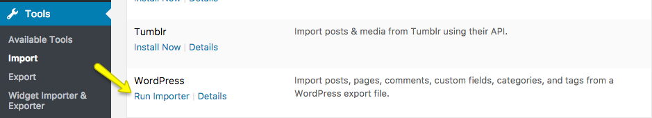
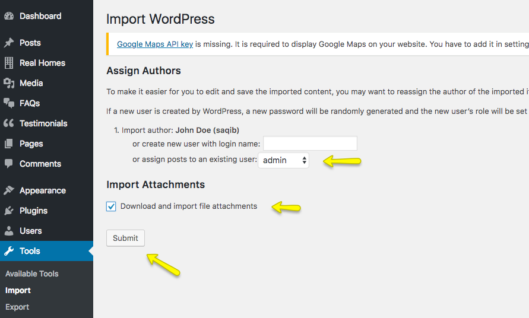
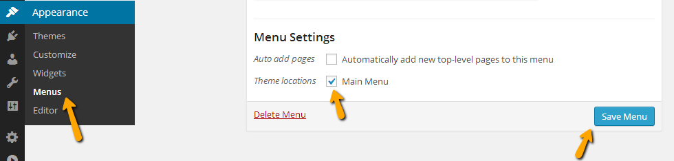

# Import Demo Contents

!!! info "Important Information"
    If you want to build a ==**Vacation Rentals**== website then you can skip to the [**How to Setup Vacation Rentals**](vacation-rentals-setup.md) guide.

You can follow one of these approaches.

- One-Click Demo Import **( Automatic & Recommended )**
- Import XML Contents, Customizer Settings, and Widgets Manually

## One Click Demo Import ( Automatic & Recommended )

### **Step 1**

Go to **Dashboard → Settings → Permalinks** and choose **Post name** from **Common Settings** and save the changes, As displayed in the screenshot below.

!!! warning "Important"
    It is crucial to complete **Step 1** as the import script is programmed to work with pretty permalinks. Otherwise, you will have configuration issues after importing demo data.

### **Step 2**

Go to **Real Homes → Demo Import** to import demo data.

Click on the blue **Import Demo** button, and you will see the following page where it will confirm the required plugins.

If any plugin is missing, the Demo Import process will install it, so click on the **Continue & Import** button again to confirm the import.

Wait for few minutes as the demo images are being fetched (downloaded) from the remote server to your website, and this process can take a couple of minutes (depending on the speed of your hosting server).

!!! warning "Important"
    Sometimes, the import process takes longer than expected and doesn't complete on the first attempt. So, import again until the process is complete.

### **Step 3**

Once the import process is complete, You will see a notice that the import is complete.

 You can click on **Visit Site** to see your website after importing the demo content. In case of any problem, Get in touch with our support team using our support site.

## Import XML Contents and Configure Settings Manually

### **Step 1**

Go to **Dashboard → Settings → Permalinks** and choose Post name from Common Settings and save the changes, As displayed in the screenshot below.

### **Step 2**

Go to **Dashboard → Tools → Import** and click Install Now shown under WordPress as displayed in the image below.

Once installed, you can activate the plugin and run it by clicking on Run Importer.

### **Step 3**

Look for the Import XML folder in the unzipped package downloaded from ThemeForest, called **rh-main-package.zip** and use the XML file of the variation of your choice, i.e., Classic or Modern, within it.

1. Assign posts to an existing author.
2. Mark the checkbox to download and import file attachments
3. Click the '**Submit**' button

The import process can take from 2 minutes to 10 minutes, depending on the speed of your hosting server. So please wait for it and try to keep the focus on the current tab in your browser.

After it is completed, you will have various posts, pages, properties, and other content on the theme demo.

### **Step 4**

Navigate to **Dashboard → Appearance → Menus**, use the Already Imported Menu from XML, and assign it to theme location "Main Menu" from the Menu Settings section below. After that, save the menu. As pointed in the screenshot below.

### **Step 5**

To configure reading settings, you need to visit **Dashboard → Settings → Reading** and choose that front page displays as a static page. Then select Home as FrontPage and News as Posts Page (displayed in the following screenshot).

### **Step 6**

To import Customizer settings, you have to install [Customizer Export/Import](https://wordpress.org/plugins/customizer-export-import/). 

Once the plugin is installed and activated, navigate to **Dashboard → Real Homes → Customize Settings → Export/Import** and select the customizer.dat file for the relevant design variation (Classic or Modern).

Upon successful import, the Customizer will be refreshed.

### **Step 7**

Now you can import widgets too. To do that, kindly install [Widget Importer & Exporter](https://wordpress.org/plugins/widget-importer-exporter/). 

After successful installation and activation, navigate to **Dashboard → Tools → Widget Importer & Exporter** and select the widgets.wie file for the relevant design variation (Classic or Modern).

Upon successful demo import, the page will reload and display the widgets which are imported.

Visit your site, and you will find your site working like the theme demo.

For any assistance, Kindly register/login at our [support website](https://support.inspirythemes.com/login-register/) and [ask your question](https://support.inspirythemes.com/ask-question/) so our support team can assist you properly.