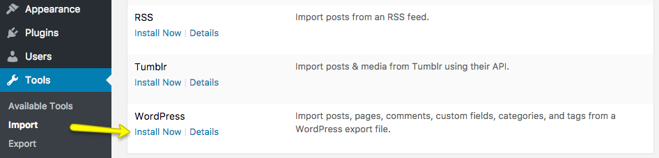

# Import Demo Content

Importing a demo is usually the fastest way to kickstart your project. It sets up your site to look just like ours, giving you a solid foundation to build on.

Watch this quick video to see the **One-Click Import** in action:

<iframe width="100%" height="430" src="https://www.youtube.com/embed/xBB4TxsyU4E?si=9IqwUhmlHjmZmP-D" title="YouTube video player" frameborder="0" allow="accelerometer; autoplay; clipboard-write; encrypted-media; gyroscope; picture-in-picture; web-share" referrerpolicy="strict-origin-when-cross-origin" allowfullscreen></iframe>

---

## Method 1: One-Click Demo Import (Recommended)

This is by far the easiest way to go.

### **Step 1: Check Permalinks**

Before we start, verify your URL structure.

1.  Head to **Settings → Permalinks**.
2.  Under **Common Settings**, make sure **Post name** is selected.
3.  Hit **Save Changes**.

!!! warning "Don't Skip This!"
    The importer needs "Post name" permalinks to do its job properly. If you skip this, things might break later on.

### **Step 2: Start Import**

1.  Go to **RealHomes → Demo Import**.
2.  Browse the designs (Ultra, Modern, Classic).
3.  Found the one you like? Click the **Import Demo** button.

### **Step 3: Confirm and Wait**

1.  You’ll see a list of plugins to install. Just click **Continue & Import**.
2.  **Hang tight.** We're downloading a lot of content and images for you. This might take a few minutes, depending on your internet and server speed.

!!! warning "If It Gets Stuck"
    If the import stalls or fails, don't panic! It's usually just a server timeout. **Run the import again.** The system is smart, it will recognize what's already there and pick up right where it left off.

### **Step 4: All Done!**

When it's finished, you’ll get a success message. Click **Visit Site** to admire your new website!

### **Step 5: Regenerate Styles (Optional)**

If colors or layouts look a tiny bit off, Elementor just needs a quick refresh.

1.  Go to **Elementor → Tools**.
2.  Click **Regenerate Files & Data**.
3.  Save changes, and you're good.

---

## Method 2: Manual Import (Advanced)

Only use this if the One-Click method just isn't working for you, usually due to strict server limits.

### **Step 1: Install Importers**

1.  Navigate to **Tools → Import**.
2.  Install the **WordPress** importer.
3.  Run it.

### **Step 2: Import Content (XML)**

1.  Unzip the **rh-main-package.zip** from ThemeForest.
2.  Find the `Import XML` folder inside.
3.  Upload the XML file for your design (like `realhomes-modern.xml`) to the WordPress importer.
4.  Assign the posts to a user and check the box to **"Download and import file attachments"**.
5.  Submit and wait.

### **Step 3: Import Menus**

1.  Go to **Appearance → Menus**.
2.  Select the menu you just imported.
3.  In **Menu Settings** at the bottom, check **Main Menu**.
4.  Save it.

### **Step 4: Set Homepage**

1.  Head to **Settings → Reading**.
2.  Select **A static page**.
3.  Set **Homepage** to "Home" and **Posts page** to "News" (or "Blog").
4.  Save changes.

### **Step 5: Import Customizer Settings**

1.  Install the [Customizer Export/Import](https://wordpress.org/plugins/customizer-export-import/) plugin.
2.  Go to **RealHomes → Customize Settings → Export/Import**.
3.  Upload the `.dat` file from the manual import folder matching your design.

### **Step 6: Import Widgets**

1.  Install the [Widget Importer & Exporter](https://wordpress.org/plugins/widget-importer-exporter/) plugin.
2.  Go to **Tools → Widget Importer & Exporter**.
3.  Upload the `.wie` file.

---

## ❓ Need a Hand?

If you're stuck, come say hi on our [support site](https://support.inspirythemes.com/ask-question/). We'll help you get sorted out!