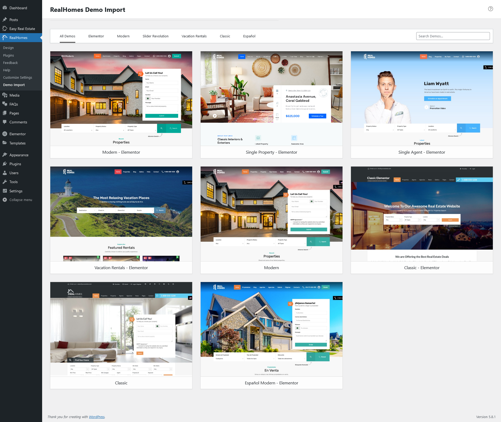
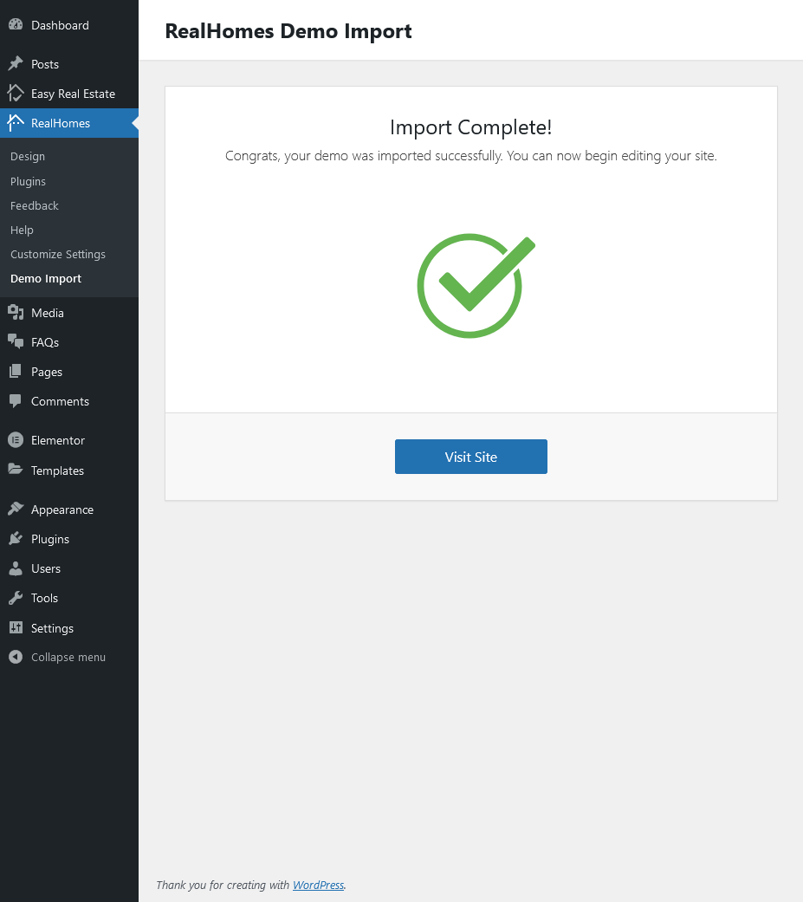

# Import Demo Contents

You can follow one of these approaches.

- One Click Demo Import **( Automatic & Recommended )**
- Import XML Contents, Customizer Settings, and Widgets Manually

## One Click Demo Import ( Automatic & Recommended )

### **Step 1**

Go to **Dashboard → Settings → Permalinks** and choose **Post name** from **Common Settings** and save the changes, As displayed in screen shot below.

### **Step 2**

!!! warning "Important"
    It is important to complete **Step 1** as import script is programmed to work with pretty permalinks. Otherwise you will have configuration issues after importing demo data.

Go to **Real Homes → Demo Import** to import demo data.

!!! note
    Since version 3.0.0, we have added a new design variation in RealHomes Theme for our clients so you will see two variations for the demo data import. You can import one variation or both and you won't have any issues. Before you begin, make sure all the required plugins are installed and activated.

Click on blue **Import** button and you will see a popup so click on the blue **Yes, import!** button again to confirm the import for the relevant layout of the theme. Wait for few minutes as the demo images are being fetched from the remote server and this process can take a couple of minutes.

!!! warning "Important"
    Sometimes, the import process takes longer than expected and doesn't complete in the first attempt. So, simply import again until the process is complete.

### **Step 3**

Once the import process is complete, You will receive a notice as the one displayed in the screen shot below.

Visit your site and you will find your site working like the theme demo. In case of any problem, Get in touch with our support team using our support site.

## 2. Import XML Contents and Configure Settings Manually

### **Step 1**

Go to **Dashboard → Settings → Permalinks** and choose Post name from Common Settings and save the changes, As displayed in screen shot below.

### **Step 2**

Go to **Dashboard → Tools → Import** and click Install Now shown under WordPress as displayed in image below.

Once installed, you can activate the plugin and run it by clicking on Run Importer.

### **Step 3**

Look for Import XML folder in unzipped package downloaded from themeforest which is called **rh-main-package.zip** and use the XML file of the variation of your choice i.e. Classic or Modern within it.

1. Assign posts to an existing author.
2. Mark the checkbox to download and import file attachments
3. Click '**Submit**' button

Import process can take a few minutes. So wait for it and try to keep the focus on current tab in your browser.

After that is done, you will have bunch of posts, pages, properties and other contents as on the theme demo.

### **Step 4**

Navigate to **Dashboard → Appearance → Menus** and use the Already Imported Menu from XML and assign it to theme location "Main Menu" from Menu Settings section below menu. After that save the menu. As pointed in screenshot below.

### **Step 5**

To configure reading settings you need to visit **Dashboard → Settings → Reading** and choose that front page displays as static page. Then select Home as FrontPage and News as Posts Page (displayed in the following screenshot).

### **Step 6**

To import Customizer settings you have to install [Customizer Export/Import](https://wordpress.org/plugins/customizer-export-import/). 

Once the plugin is installed and activate then navigate to **Dashboard → Real Homes → Customize Settings → Export/Import** and then select the customizer.dat file for the relevant design variation (Classic or Modern).

Upon successful import the Customizer will be refreshed.

### **Step 7**

Now you can import widgets too. In order to do that, kindly install [Widget Importer & Exporter](https://wordpress.org/plugins/widget-importer-exporter/). 

After successful installation and activation navigate to **Dashboard → Tools → Widget Importer & Exporter** and then select the widgets.wie file for the relevant design variation (Classic or Modern).

Upon successful demo import the page will reload and display the widgets which are imported.

Visit your site and you will find your site working like the theme demo. In case of any problem, Get in touch with our support team using our support site.