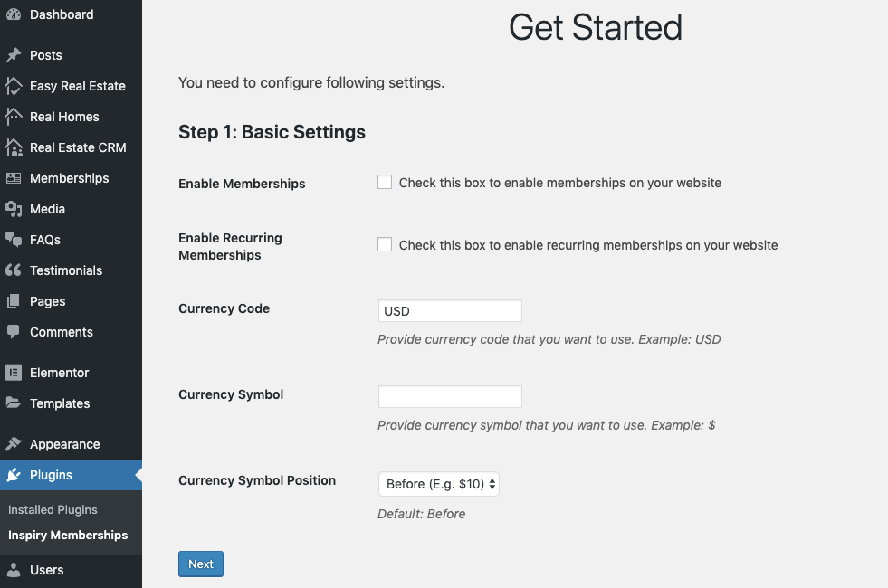

# Basic Settings

This section allows you to configure the following basic settings:

1. Enable/Disable memberships.

2. Enable/Disable recurring memberships.

3. The currency code of the currency in which you are going to charge your customers.

4. The symbol of the currency you are using.

5. And the currency symbol position.

Once you are done, click **Next** button to move to next step.