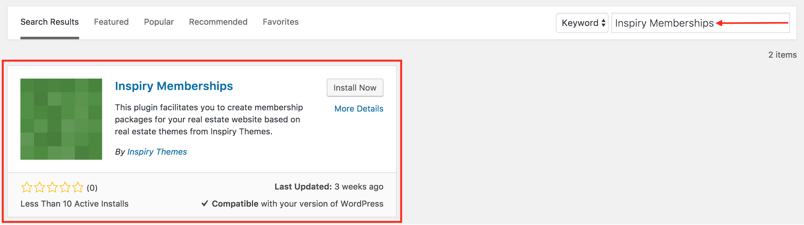
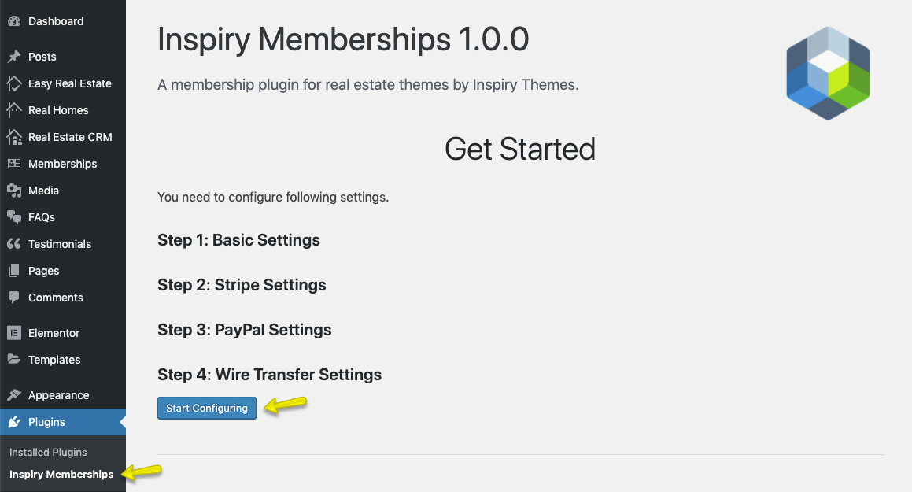

# Install Inspiry Memberships Plugin

You have to install and configure [Inspiry Memberships Plugin](https://wordpress.org/plugins/inspiry-memberships/) to setup memberships.

Navigate to **Dashboard → Plugins → Add New** and search for **Inspiry Memberships** as displayed in the screenshot below: 

Once you have found it then click the **Install Now**, Activate it after installation.

After activation, will be redirected to plugin's welcome page.

You can start configuring the settings of the plugin by clicking on the Start Configuring button.

To configure the plugin, please follow these steps:

1. Configure **Basic Settings**
2. Configure **Stripe Settings**
3. Configure **PayPal Settings**
4. Configure **Wire Transfer Settings**