# PayPal Settings

This section belongs to the settings related to **PayPal**. You can:

1. Enable/Disable PayPal Payments.
2. Enable/Disable sandbox mode of PayPal.
3. Set API keys of PayPal account.
4. Set PayPal IPN URL.
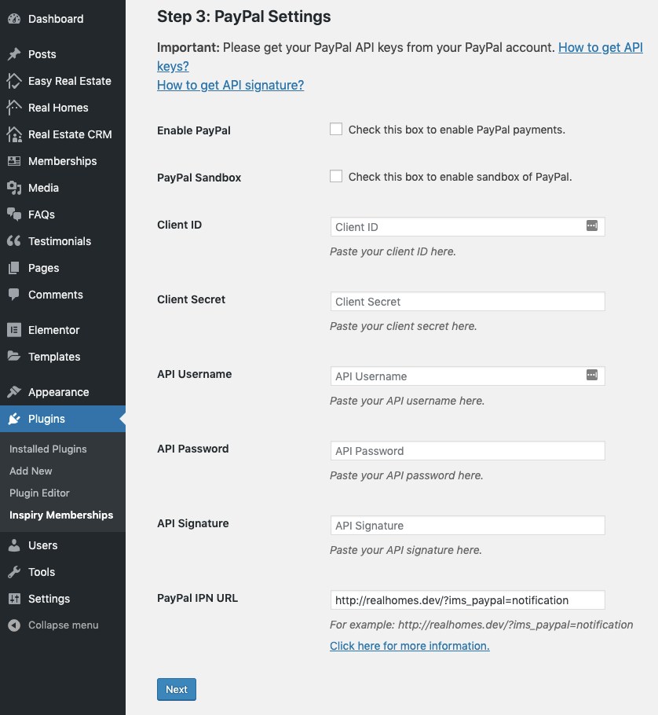
5. Get PayPal Client ID and Client Secret

**Follow these instructions:**

1. Go to Paypal developer Site.
2. Scroll down and click on Create App under the heading **REST API apps**. 
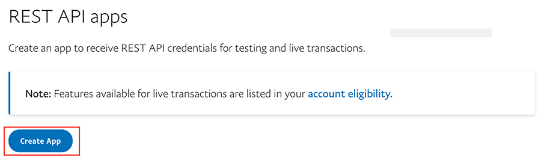
3. Choose name of your app and click **Create App**. 

4. Now you can see and manage your client ID and secret. 
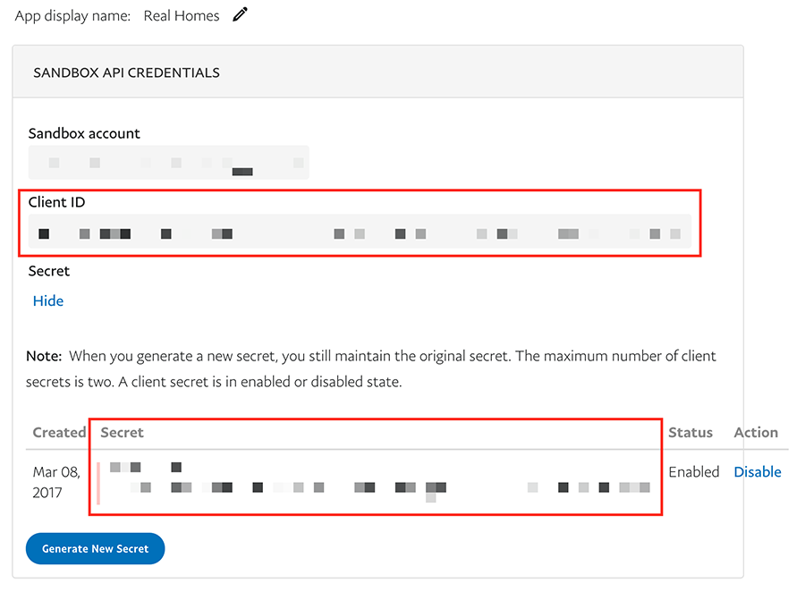

### Create PayPal API Signature

**Follow these instructions:**

1. For live credentials, log in to your PayPal business account at www.paypal.com. For test credentials, log in to the PayPal Sandbox at www.sandbox.paypal.com using a Sandbox business test account.
2. Click Profile on the top right side of the page. From the Business Profile menu, select Profile and Settings. 
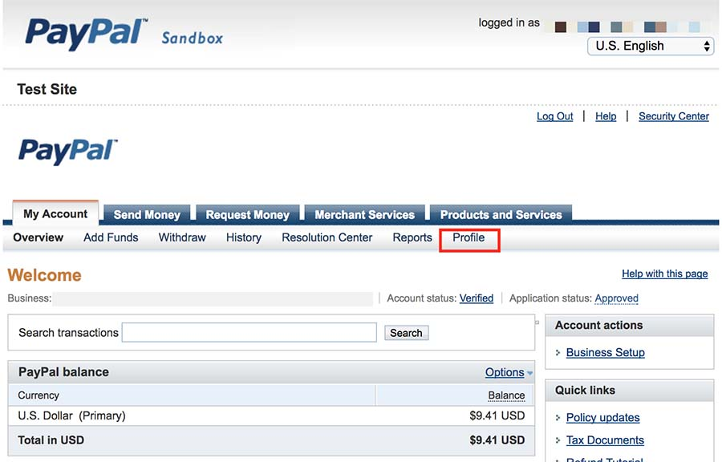
3. From the left menu, click Request API credentials. 
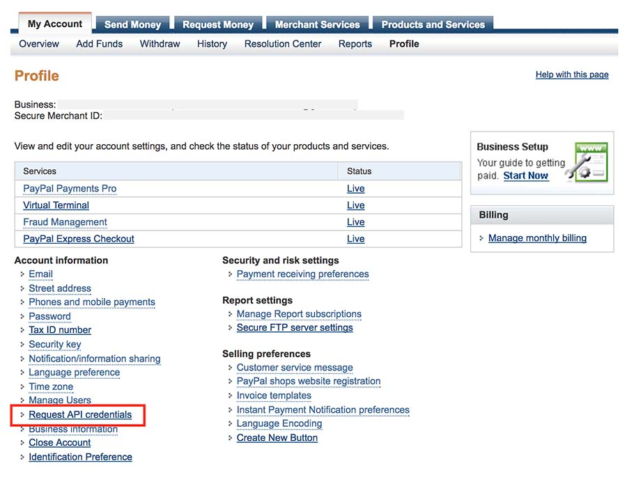
4. In Request API credentials section, click Set up PayPal API credentials and permissions. 
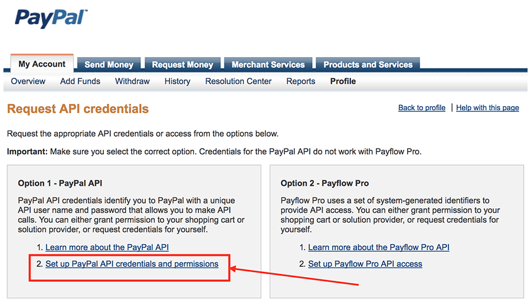
5. To generate the API signature, click View API Signature on the API Access page. 
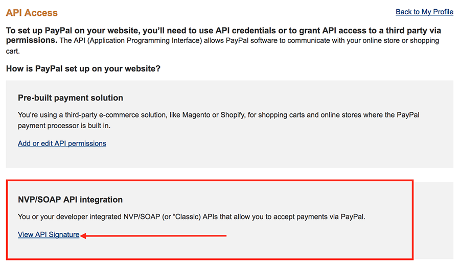
6. To view API Username, Password, Signature, click Show. 
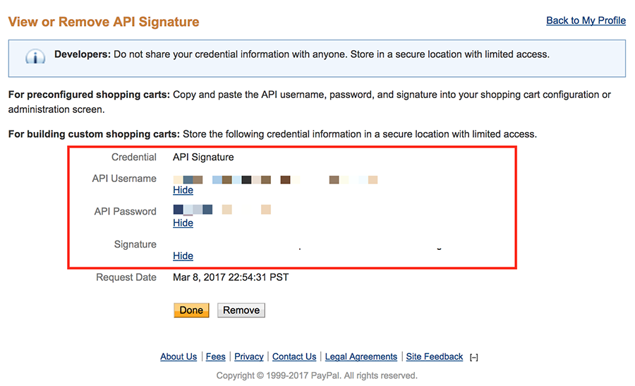

### Register PayPal IPN URL

> Note: It is important to register PayPal IPN URL for recurring payments. To register the IPN, follow these instructions:

1. Copy the URL present in the PayPal IPN URL text box. Or go to **Dashboard → Memberships → Settings → PayPal Settings**; there will be a text box named **PayPal IPN URL** present at the end of this page and copy the URL from this text box. 
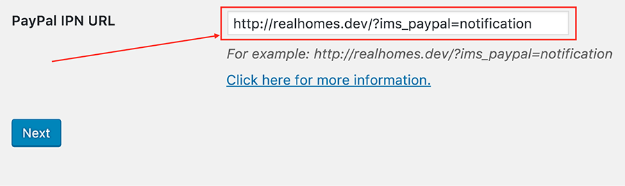
2. Go to **PayPal Live** for live account; or **PayPal Sandbox** for sandbox account. Log in with your account.
3. Click **Profile** on the top right side of the page. From the Business Profile menu, select **Profile and Settings**. 

4. From the menu, click **Instant Payment Notification Preferences**. 
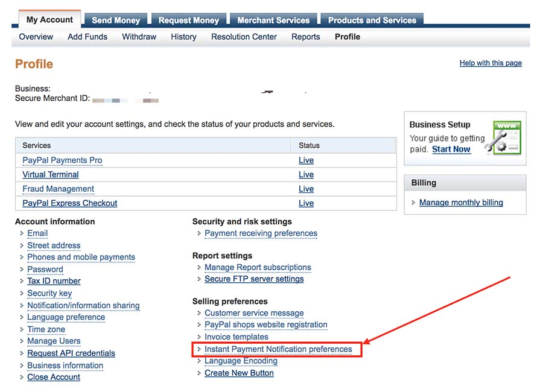
5. Click on the **Choose IPN Settings** to set the IPN settings for your website. 
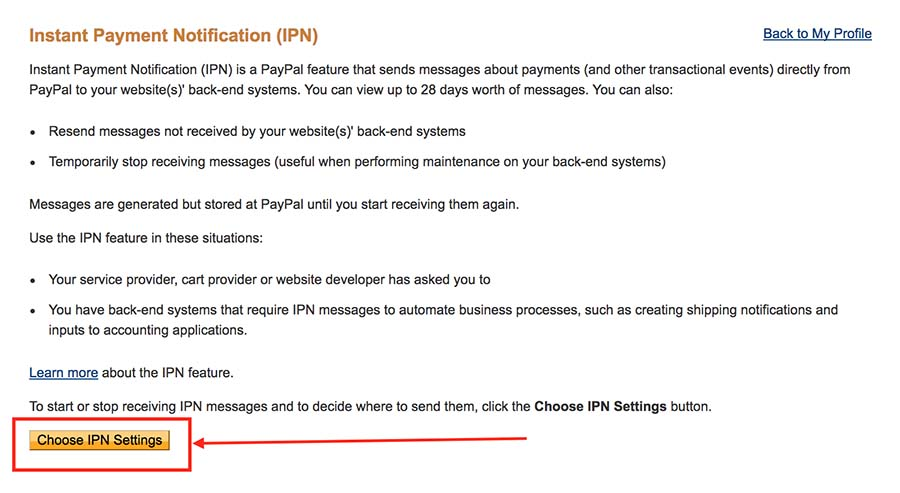
6. Paste the URL you copied earlier in the **Notification URL** text box. Then select Receieve IPN Messages (Enabled) in **IPN Messages** option and click on the **Save** button to save your settings. 
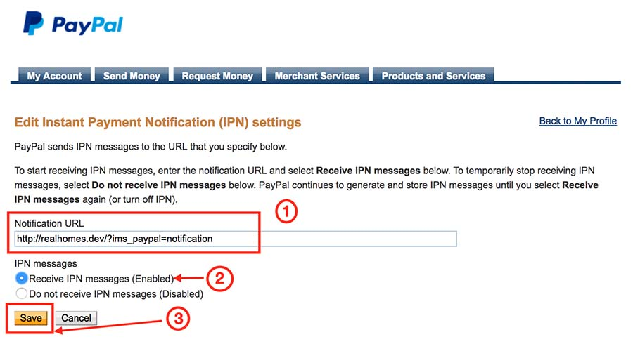