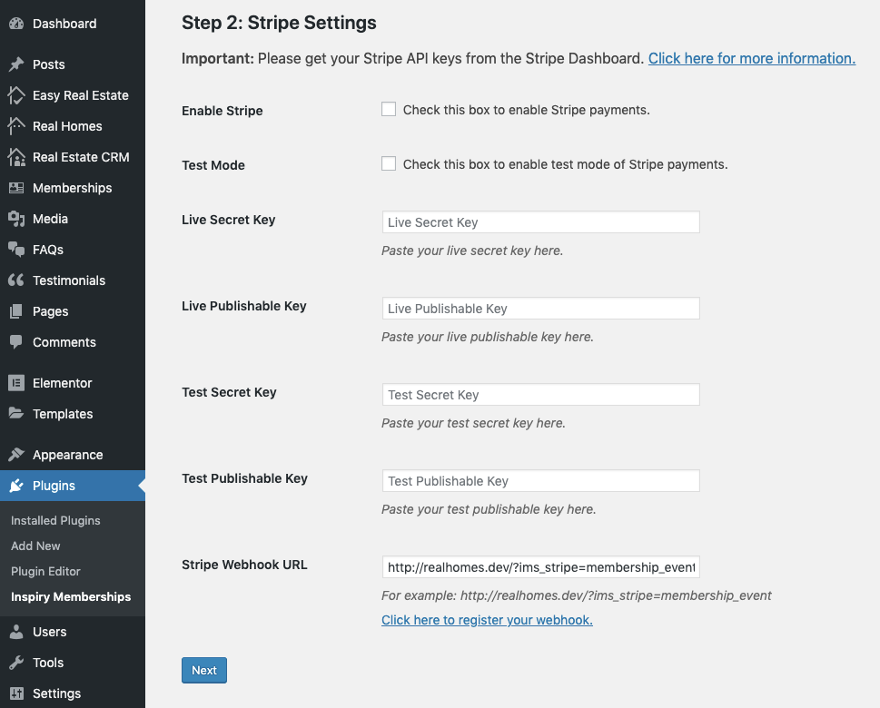
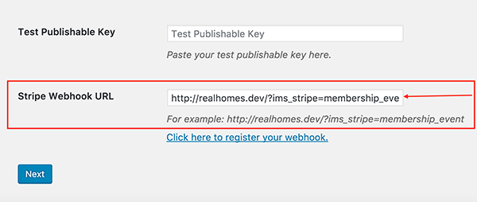
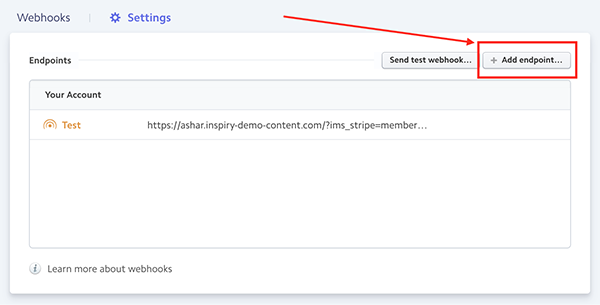
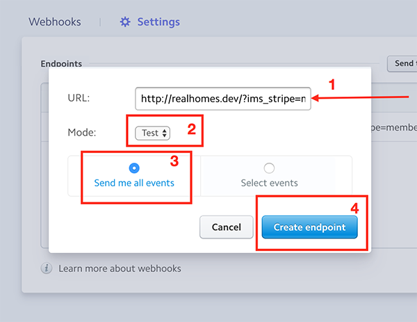
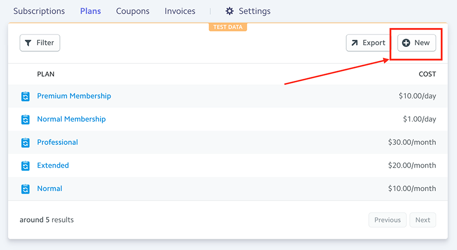
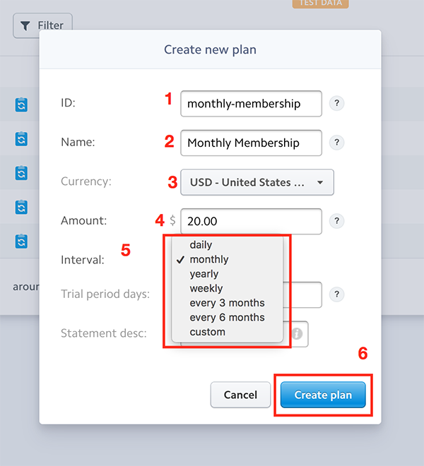
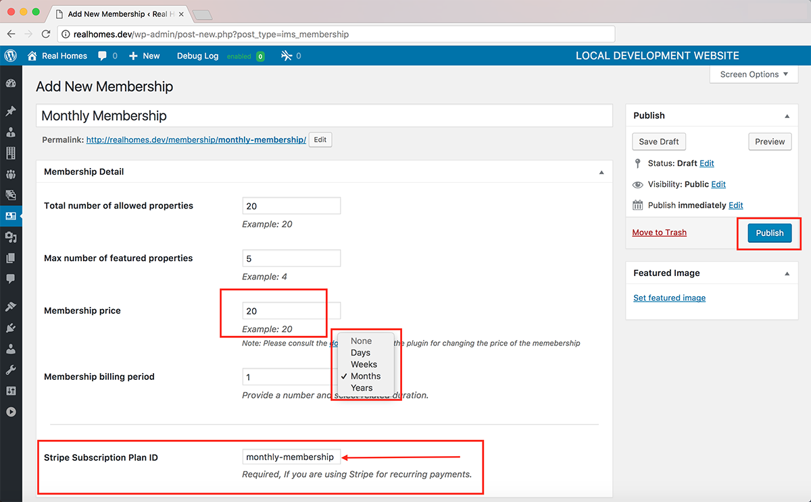

# Stripe Settings

This section belongs to the settings related to Stripe Payment System. You can:

1. Enable/Disable Stripe Payments.
2. Enable/Disable test mode of Stripe.
3. Set API keys of Stripe account.
4. Set the webhook URL of Stripe.

### How to register webhook URL

> Note: Webhook URL plays an important role in accepting recurring payments through Stripe. It is important to set the webhook URL correctly otherwise recurring memberships through Stripe will not work properly.

Follow these instructions to register webhook URL:

1. Copy the URL present in the **Stripe Webhook URL** text box. 

2. Go to Webhook Settings present in the Stripe Dashboard.
3. Click on **Add endpoint**... button present on the top right corner of the Endpoints box. 

4. Paste the URL you copied earlier in the URL text box.
5. Then select the mode in which you will be using Stripe. After finishing, click on **Create Endpoint** button to add the URL to Stripe. 

### How to make a recurring membership package using Stripe

Please follow these instructions to make a recurring membership package using Stripe.

1. Go to **Plans** present in the **Stripe Dashboard**.
2. Click on **New** button present on the top right corner. 

3. Enter the details of your new membership package. And click on the **Create Plan** button to create the subscription. 

	> Note: Please note that Inspiry Memberships only support daily, weekly, monthly and yearly memberships. Please keep this in mind while creating your subscription plan.
4. Once you are done creating the plan, copy the **ID** of the plan. After that, go to **Dashboard → Memberships → New Membership** and enter the details of your plan here. Then paste the ID of the plan that you created on **Stripe Dashboard** in **Stripe Subscription Plan ID** text field. Once done, click on the **Publish** button to create the membership on your website. 

