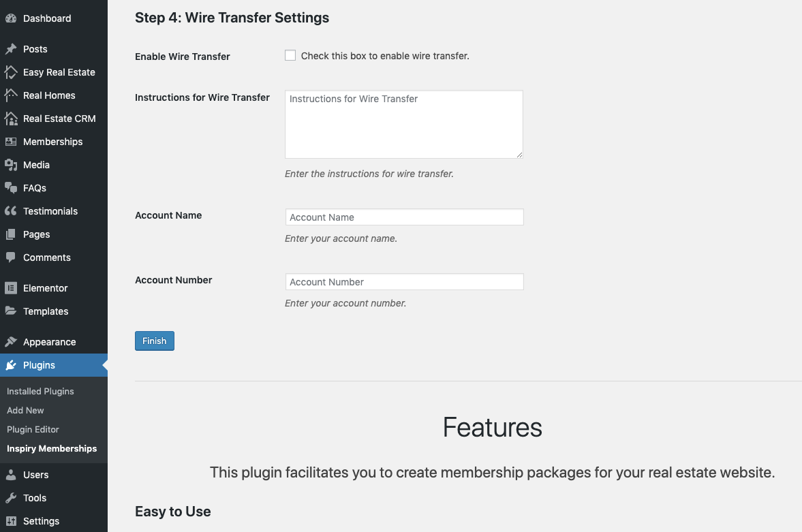
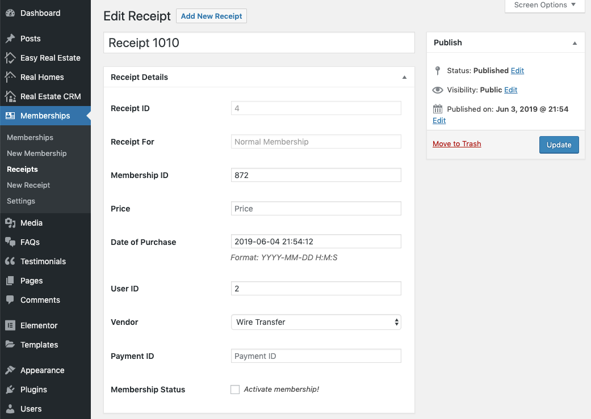

# Wire Transfer Settings

This section belongs to the settings related to **Wire Transfer**. You can:

1. Enable/Disable payments via Wire Transfer.
2. Provide instructions for wire transfer.
3. Provide account name.
4. Provide account number.

5. Click on **Finish** button once done.

### Activating Membership

All the memberships bought throught wire transfers require manual activation. Once the payment confirmation is received, membership has to be activated manually. To activate the membership manually, go to the user receipt, check the **Membership Status** checkbox and click **Update** button to activate the membership. 

