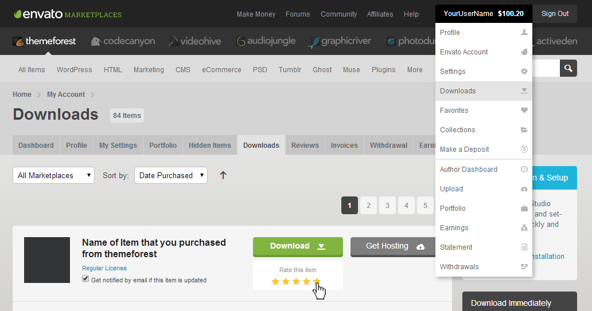

This documentation is last updated on **4th February 2019**.

Thanks for purchasing **Real Homes WordPress Real Estate Theme**. Any question that is beyond the scope of this documentation should be asked on our [support website](http://support.inspirythemes.com/). You can visit [this knowledge base article](https://support.inspirythemes.com/knowledgebase/how-to-get-themeforest-item-purchase-code/) to learn about how to get item purchase code from themeforest.net to sign-up on our support site.

### **Important Note**

It is highly recommended to use the child theme so that you can easily update parent theme whenever a new update is available. A pre-built ready to use child theme is included in the main theme pack which you have downloaded from ThemeForest. It is commonly called **rh-main-package.zip**.

Please note some features (which you find in Classic Design) might not be available yet for Modern Design of Real Homes Theme. We are working on adding every possible feature in Modern Design but some of them are simply not possible to add due to design limitations.

##Few Performance Improvement Tips

### **Basic Recommendations**

* Use **PHP 7.2 or greater** as it is faster than previous versions of PHP and a [base requirement of WordPress](https://wordpress.org/about/requirements/). ( You can communicate with your hosting provider to get it updated. )
* Make sure your hosting is based on SSD drives.
* It is recommended that you should use a VPS instead of shared hosting as it gives you better resources to work on.
* Use a good cache plugin and test your site properly after installing and configuring it.

### **Real Homes Specific**

* Do not unify (combine) JavaScript files for Real Homes theme while using a cache plugin ( or any optimisation plugin ) as it is not an average blog theme and certain scripts are only loaded when required. Also, dynamic data is generated before few scripts based on various settings. So, Combining JavaScript files can create errors.
* Real Homes uses following cookies (if related settings are enabled). So, You can configure your cache plugin to not cache pages that uses these cookies OR you can request the same from your host if your host is like WPEngine ( who do not allow cache plugin and handles the cache on server level ).
    - inspiry_compare
    - inspiry_favorites
    - current_currency

## How to Update Theme

If you want to update your theme then you can consult [this knowledge base article for automatic update](https://support.inspirythemes.com/knowledgebase/update-theme-using-envato-wordpress-toolkit/) OR you can consult [this knowledge base article to safely update Real Homes Theme](https://support.inspirythemes.com/knowledgebase/how-to-update-real-homes-theme-safely/).

If you like this theme, please support us by rating this theme with **5 stars**. ★★★★★

## Support Policy

### **Support Includes**

- Answering technical questions about theme features.
- Assistance with reported bugs and issues.
- Help with included 3rd party assets.

### **Support Does Not Includes**

- Theme customization services.
- Theme installation services.