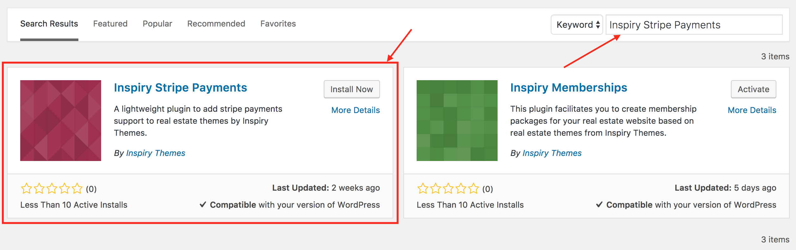
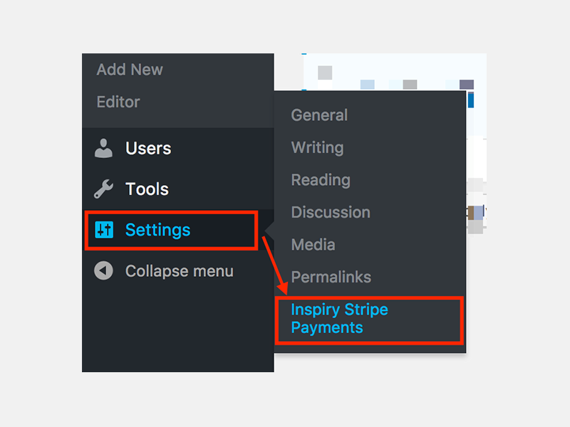
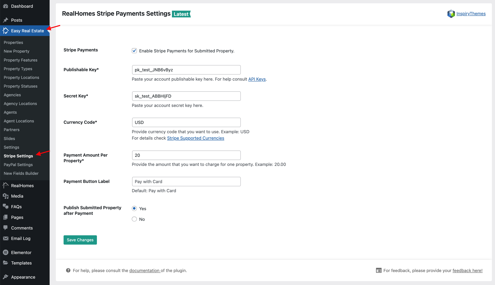

# Inspiry Stripe Payments 

### Installation & Setup

You can install and setup [Inspiry Stripe Payments Plugin](https://wordpress.org/plugins/inspiry-stripe-payments/) to accept payments for properties through **Stripe**.

1. Please navigate to **Dashboard → Plugins → Add New** and search for "**Inspiry Stripe Payments**" as shown in the screenshot below: 

2. Once you have found it then click the "**Install Now**" link under the Inspiry Stripe Payments for WordPress plugin in the list of results.

3. Click the "**Activate Plugin**" link after the plugin has been installed.

### Inspiry Stripe Payments Plugin Setup

To setup Inspiry Stripe Payments you will need to go to the settings page of the plugin.

1. Kindly navigate to **Dashboard → Settings → Inspiry Stripe Payments**. 

2. Update the settings according to your needs and click **Save Options** at the bottom of the page to save the settings. 

!!! note
    You can get the **API keys** of the stripe from **Stripe Dashboard**. Please click here for more details.
