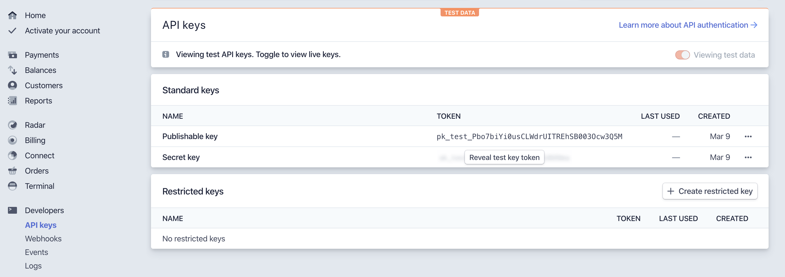

# Individual Property Payments Using Stripe

### Installation & Setup

You have to install [Inspiry Stripe Payments](https://wordpress.org/plugins/inspiry-stripe-payments/) plugin to accept payments for individual properties using **Stripe**.

1. Navigate to **Dashboard → Plugins → Add New** and search for **Inspiry Stripe Payments** as displayed in the screenshot below: 
	
	

2. Once found, **Install** and **Activate**  the plugin.

## Configure related Settings

1. Go to https://dashboard.stripe.com/test/dashboard and sign up or log in for your account.

2. Click on **Developer &rarr; API Keys** and you will see your API Keys there.

	

3. Navigate to **Dashboard → Settings → Inspiry Stripe Payments** and you can use your API Keys you have found in the last step.
	
	

3. Configure the settings as per your requirements and **Save Options**.
 
4. Once done, You can visit my properties page on your website to view Stripe payment button for individual properties.
	
	
	
!!!note
	In case of any issue, you can signup/login to our [support website](https://support.inspirythemes.com/login-register/) and [ask your question](https://support.inspirythemes.com/ask-question/) over there.
