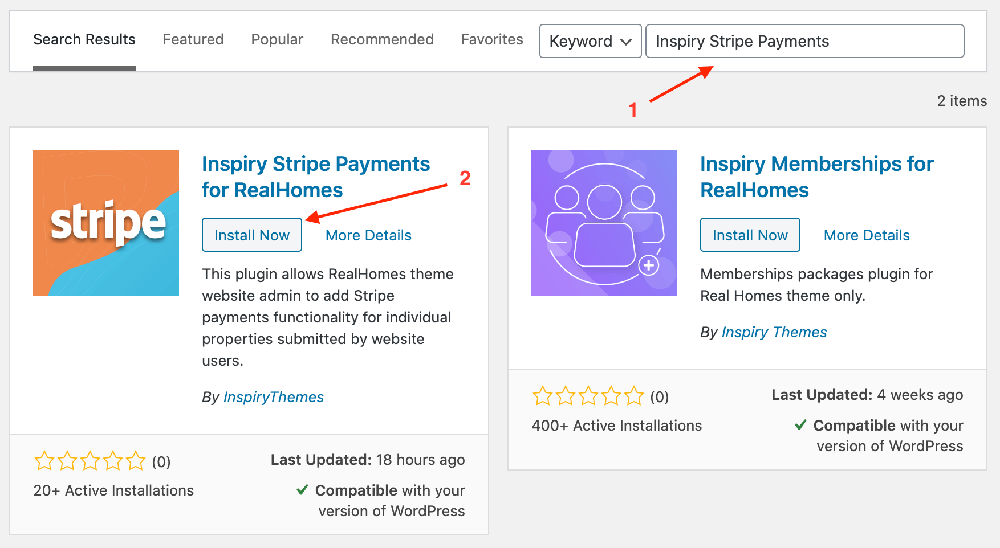

# Individual Property Payments Via Stripe

To enable Stripe payments for the individual properties you would need to install and configure the [Inspiry Stripe Payments for RealHomes](https://wordpress.org/plugins/inspiry-stripe-payments/) plugin. Plesae follow the steps given blow.

!!!important "Prerequisite"
	Before you start following the Stripe payments setup guide, please make sure the **RealHomes theme** and its **Easy Real Estate plugin** are installed and activated on your site.

## Install & Activate 'Inspiry Stripe Payments for RealHomes' Plugin

1. Navigate to **Dashboard → Plugins → Add New** and search for **Inspiry Stripe Payments** as displayed in the screenshot below: 
	
	

2. Once found, **Install** and **Activate**  the plugin.

## Configure Plugin Settings

1. Navigate to **Dashboard → Easy Real Estate → Stripe Settings** page. This page contains the following settings.

	- Enable/Disable Stripe Payments.
	- Stripe Account API Keys.
	- Currency Code (in which you want to charge your users).
	- Payment Amount Per Property.
	- Payment Button Label.
	- Publish Submited Property after Payment.

2. Configure all the settings as per your preferences. For help to get your Stripe account **Publishable Key** and **Secret Key** you can follow [Retrieving the API Keys](https://inspirythemes.com/realhomes-memberships-setup/#retrieving-stripe-api-keys) section.

6. Once done, visit *My Properties* page on your website to view Stripe payment button for individual properties.

	

!!!note
	In case of any issue, you can signup/login to our [support website](https://support.inspirythemes.com/login-register/) and [ask your question](https://support.inspirythemes.com/ask-question/) over there.
