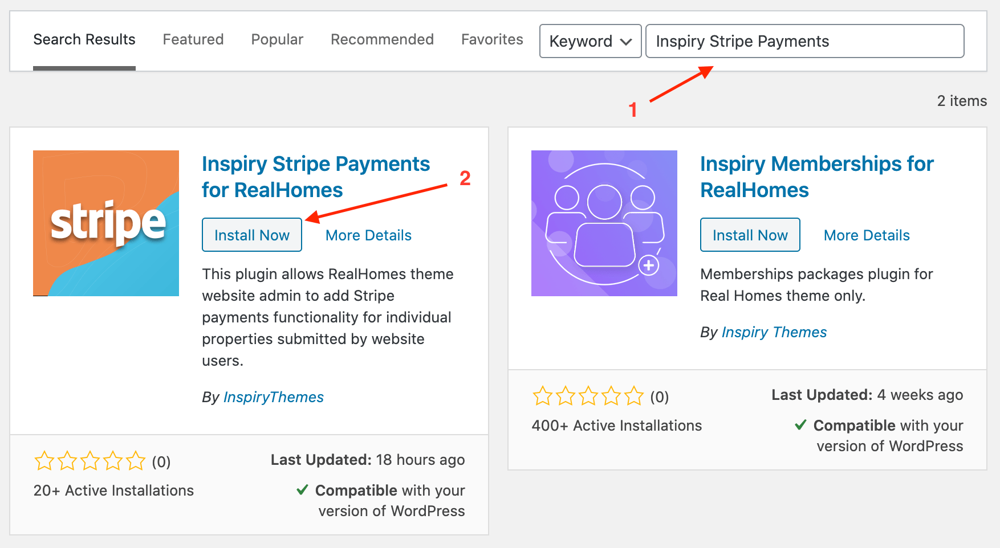
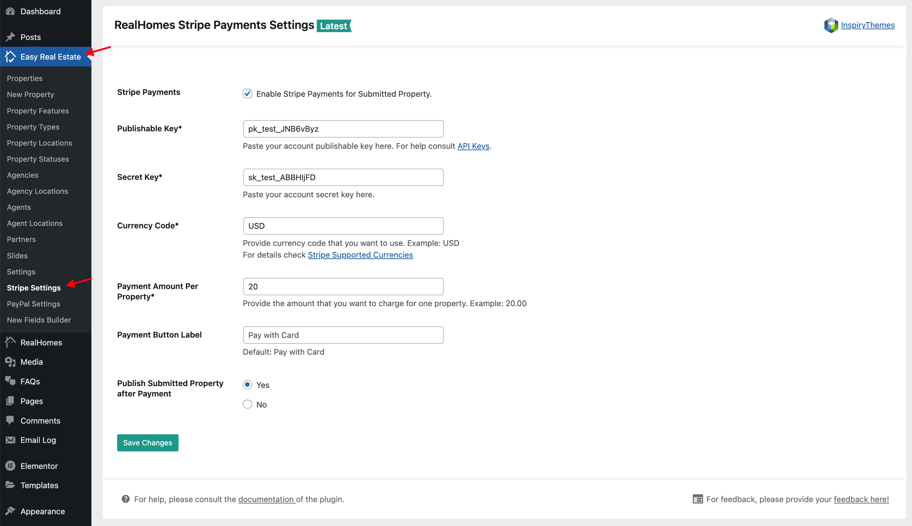

# Individual Property Payments Via Stripe

To enable Stripe payments for individual properties, install and configure the [Inspiry Stripe Payments for RealHomes](https://wordpress.org/plugins/inspiry-stripe-payments/) plugin.

!!!important "Prerequisite"
	Before starting, ensure the **RealHomes theme** and its **Easy Real Estate plugin** are installed and activated.

## Install & Activate 'Inspiry Stripe Payments for RealHomes' Plugin

1. Navigate to **Dashboard → Plugins → Add New** and search for **Inspiry Stripe Payments**. 
	
	

2. **Install** and **Activate** the plugin.

## Configure Plugin Settings

1. Navigate to the Stripe settings page based on your version:

=== "v4.5.1 and Later"

    !!! success "RealHomes Settings"
        Dashboard ➤ RealHomes ➤ Settings ➤ Stripe Settings

=== "v4.5.0 and Earlier"

    !!! info "Legacy Settings"
        Dashboard ➤ Easy Real Estate ➤ Stripe Settings

    

This page contains the following settings:

	- Enable/Disable Stripe Payments.
	- Stripe Account API Keys.
	- Currency Code.
	- Payment Amount Per Property.
	- Payment Button Label.
	- Publish Submitted Property after Payment.

2. Configure all settings. For help retrieving your **Publishable Key** and **Secret Key**, refer to [Retrieving the Stripe API Keys](https://inspirythemes.com/realhomes-memberships-setup/#retrieving-stripe-api-keys).

6. Once done, visit the *My Properties* page to view the Stripe payment button.

	

!!!note
	In case of any issue, you can signup/login to our [support website](https://support.inspirythemes.com/login-register/) and [ask your question](https://support.inspirythemes.com/ask-question/).
