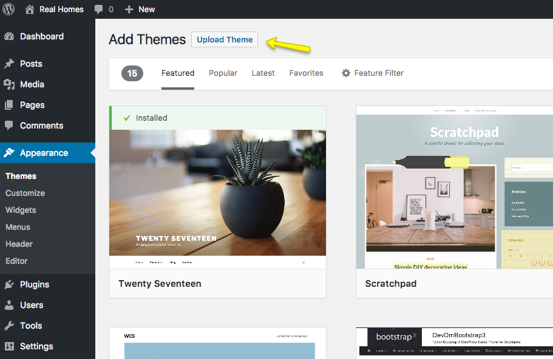
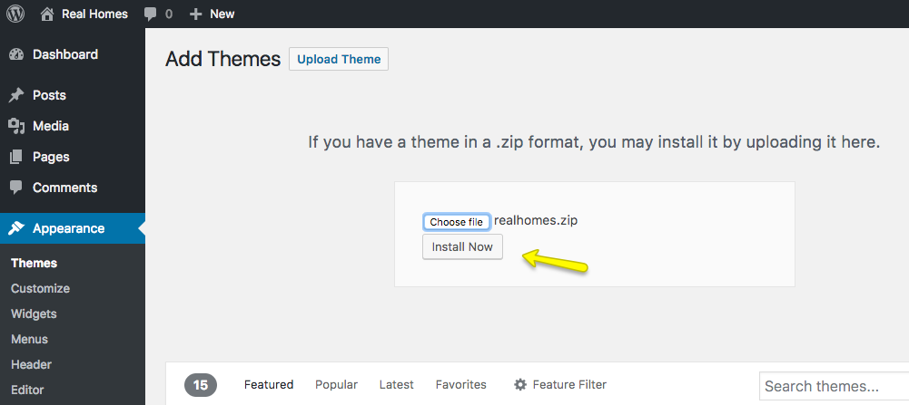
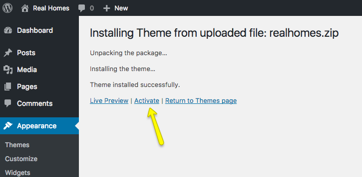
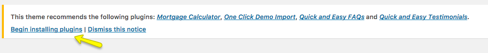
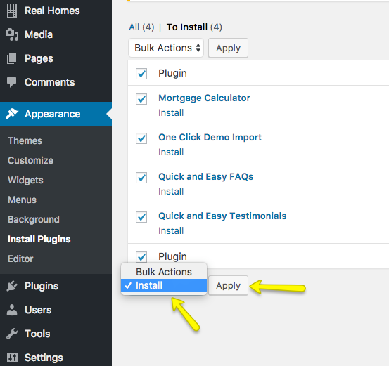
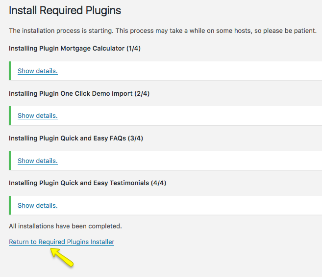
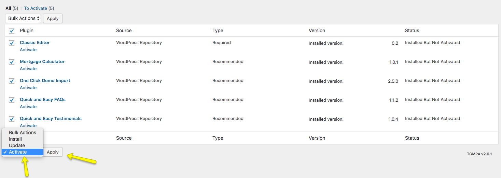
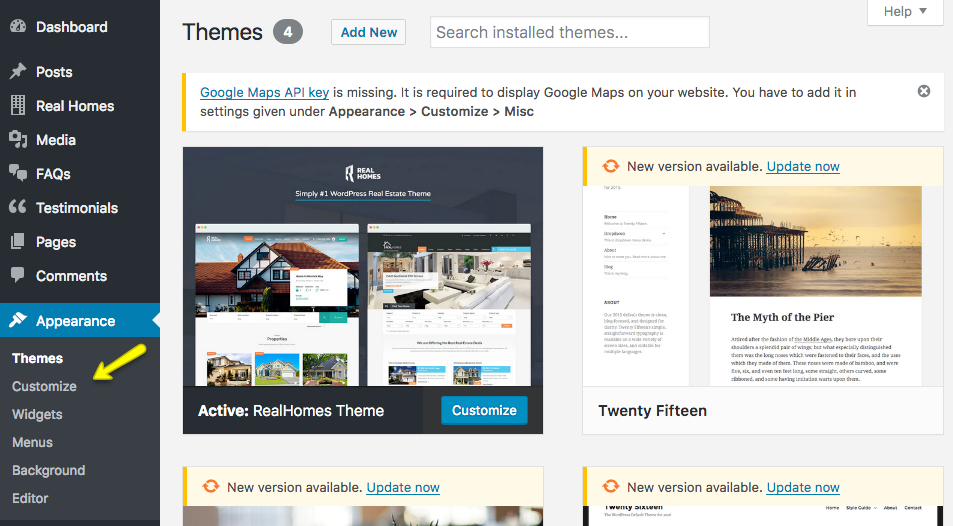

# Installation

To start you must have a working version of WordPress. Almost all major web hosts provides one click WordPress install and you can consult your host's help site for more information in this regard. For manual install you can consult WordPress Codex Installing WordPress especially the Requirements.

Once you have a working version of WordPress, You need to download "**All Files and Documentation**" from themeforest download page and extract the downloaded zip to get required files including **realhomes.zip**.

## Install Theme Via WordPress Dashboard ( _Recommended_ )

- Go to '**Appearance → Themes**' section
- Click '**Add New**' and select the '**Upload Theme**' option 

- Click '**Upload Theme**' 

- Choose the **realhomes.zip** file and press '**Install Now**' 

- Once the theme is uploaded you need to activate it. 

- A notice will be displayed right after the activation of the theme asking you to install and activate the required plugins. So, go ahead and click on Begin installing plugins. 

- On next page you will see the list of plugins to install. Select all the plugins and click on **Install** and then click on **Apply** to install all of them at once (as shown in the screenshot below).  

- After all the plugins are installed click on **Return** to **Required Plugins Installer**. 

- Once again select all the plugins and click on **Activate** and then click on **Apply** to activate all the plugins and you are done. 

- After activation go to "**Appearance → Customize**" to play with theme's settings. You can also import the demo data before changing any settings in the Customizer. 

if you face any problem during upload through dashboard, please upload the theme using FTP as guided below.

## Install Theme Via FTP ( Alternative Way )

1. Access your hosting server using an ftp client like **FileZilla**
2. Go to the '**wp-content → themes**' folder of your WordPress installation
3. Extract the **realhomes.zip** file and put the realhomes folder in '**wp-content → themes**' folder
4. Go to '**Dashboard → Appearance → Themes**' section to activate the theme
5. After activation go to "**Dashboard → Appearance → Customize**" to play with theme's settings.

## Install Child Theme ( Highly Recommended )

It is highly recommended to use child theme, So that you can easily update parent theme whenever a new update becomes available. A pre-built ready to use child theme is included in the main theme pack that you have downloaded from themeforest.

To install child theme, You need to upload the **realhomes-child.zip** and activate it in the same way as you have uploaded and activated parent theme's **realhomes.zip**.