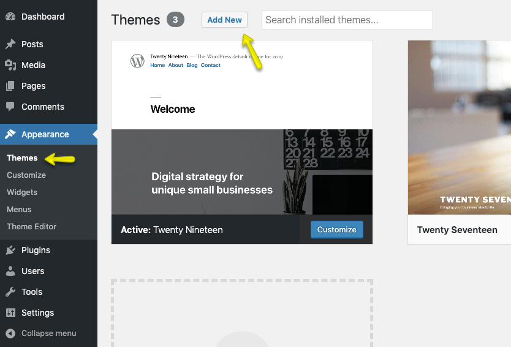

# Installation

To start you must have a working version of WordPress. Almost all major web hosts provide one-click WordPress install and you can consult your host's help site for more information in this regard. For manual installation, you can consult WordPress Codex Installing WordPress especially the Requirements.

Once you have a working version of WordPress, You need to download "**All Files and Documentation**" from themeforest download page (screenshot below) and extract the downloaded zip to get required the files including **realhomes.zip**.

## Install Theme Via WordPress Dashboard ( _Recommended_ )

- Go to **Appearance → Themes** section and click **Add New**

- Click **Upload Theme**

- Choose the **realhomes.zip** file and press **Install Now**

- Once the theme is uploaded you need to activate it. 

- Once you activated the theme, you will be redirected to the RealHomes welcome page. Here you select your desired design variation and click the **Save Changes** button. 

For more details please check [Design Selection](design-selection.md) page.
- Also, a notice will be displayed at the top of welcome page asking you to **Enter Item Purchase Code** and then click on the **Verify** button. RealHomes purchase verification allows you to **install plugins, import demo contents** and avail **auto updates**. For help to retrieve RealHomes purchase code you can follow our knowledge base article on [How to Get Themeforest Item Purchase Code](https://support.inspirythemes.com/knowledgebase/how-to-get-themeforest-item-purchase-code/) 

- After **RealHomes Purchase Verification**, a notice will be displayed at the top asking you to install and activate the required plugins. So, go ahead and click on **Begin installing plugins**.

- On next page you will see the list of plugins to install. Select all the plugins and click on **Install** and then click on **Apply** to install all of them at once (as shown in the screenshot below).  

- After all the plugins are installed click on **Return** to **Required Plugins Installer**. 

- Once again select all the plugins and click on **Activate** and then click on **Apply** to activate all the plugins and you are done. 

- After activation go to "**Real Homes → Customize Settings**" to play with theme's settings. You can also import the demo data before changing any settings in the Customizer. 

if you face any problem during upload through dashboard, please upload the theme using FTP as guided below.

## Install Theme Via FTP ( Alternative Way )

1. Access your hosting server using an ftp client like **FileZilla**
2. Go to the '**wp-content → themes**' folder of your WordPress installation
3. Extract the **realhomes.zip** file and put the realhomes folder in '**wp-content → themes**' folder
4. Go to '**Dashboard → Appearance → Themes**' section to activate the theme
5. After activation go to "**Dashboard → Real Homes → Customize Settings**" to play with theme's settings.

## Install Child Theme ( Highly Recommended )

It is highly recommended to use child theme, So that you can easily update parent theme whenever a new update becomes available. A pre-built ready to use child theme is included in the main theme pack that you have downloaded from themeforest.

To install child theme, You need to upload the **realhomes-child.zip** and activate it just like a normal WordPress Theme.