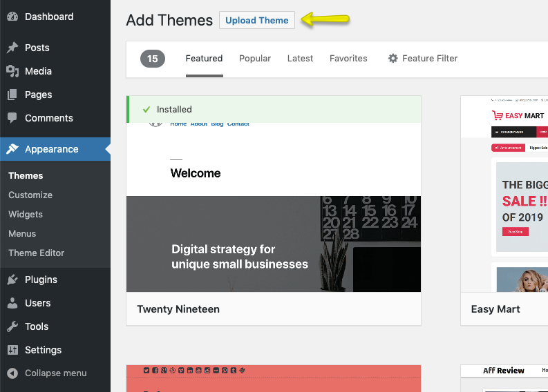

# Installation Guide

Welcome aboard! 🎉 Let's get your RealHomes theme up and running.

Before you dive in, make sure your hosting environment meets the official [WordPress requirements](https://wordpress.org/about/requirements/). RealHomes works seamlessly on most hosting types—shared, reseller, or dedicated—as long as WordPress runs properly.

---

## ✅ Before You Begin

You'll need a working WordPress installation first. Most web hosts offer **one-click WordPress installs**. If you’re installing manually, follow this [WordPress Installation Guide](https://wordpress.org/support/article/how-to-install-wordpress/).

Once WordPress is set up, download the **“All Files and Documentation”** package from ThemeForest and extract it. Inside, you'll find the key file: `realhomes.zip`.

!!!tip "Important: Upload the Correct File"
    You must extract the main package you downloaded from ThemeForest first. Do **not** upload the entire package directly to WordPress. The file you need to upload is `realhomes.zip`, which is found inside.

---

## 📦 Install the Theme via WordPress Dashboard (Recommended)

### Step 1: Upload and Activate

1.  Go to **Appearance → Themes → Add New**.
2.  Click **Upload Theme**.
3.  Select `realhomes.zip` and click **Install Now**.
4.  Once installed, click **Activate**.

---

### Step 2: Select a Design Variation

After activation, you’ll land on the **RealHomes Welcome Page**. Select your preferred design variation (Ultra, Modern, or Classic), then click **Save Changes**.

> For a breakdown of each design, visit [Design Selection](design-selection.md)

---

### Step 3: Activate Your License

To unlock the full potential of RealHomes:

-   Enter your **Item Purchase Code**.
-   Click **Verify**.

This step enables access to **demo import, plugin installation**, and **auto-updates**.

Need help finding your code? Check out our guide:
👉 [How to Get ThemeForest Purchase Code](https://support.inspirythemes.com/knowledgebase/how-to-get-themeforest-item-purchase-code/)

---

### Step 4: Install Required Plugins

After license verification, you'll be prompted to install the plugins that power your theme. This is a two-part process: first you install them, then you activate them.

1.  Click **Begin installing plugins**.
2.  On the next screen, **select all** plugins, choose **Install** from the dropdown, and click **Apply**.
3.  Once the installation is complete, click **Return to Required Plugins Installer**.
4.  Now, **select all** plugins again, choose **Activate** from the dropdown, and click **Apply**.

---

### Step 5: Set Permalinks

For clean, SEO-friendly URLs, navigate to:

**Dashboard → Settings → Permalinks**
Select **Post name** and save.

---

### Step 6: Elementor Initial Settings

To ensure Elementor uses the theme's beautifully designed styles instead of its own defaults, navigate to: **Dashboard → Elementor → Settings**

On the **General** tab, enable both:

-   ✅ Disable Default Colors
-   ✅ Disable Default Fonts

---

## 🛠️ Alternate Installation Method: FTP

If you're facing upload issues, try FTP:

1.  Connect to your server via an FTP client (e.g., FileZilla).
2.  Navigate to the `wp-content/themes/` directory on your server.
3.  Extract `realhomes.zip` on your computer and upload the resulting `realhomes` folder to this directory.
4.  Go to your **Dashboard → Appearance → Themes** and **Activate** the RealHomes theme.
5.  After activation, proceed with **Step 2 (Select Design)**, **Step 3 (Activate License)**, and **Step 4 (Install Plugins)** from the WordPress Dashboard method above to complete the setup.

---

## 👶 Install the Child Theme (Highly Recommended)

If you plan to add custom CSS or modify theme files, you should use the child theme. This ensures that your custom changes are safe and will not be overwritten when you update the main RealHomes theme in the future.

The `realhomes-child.zip` file is included in your download package. You can install and activate it just like the main `realhomes.zip` theme.

---

## ⚠️ Common Installation Issues

These are the most frequently encountered issues and their fixes:

!!! error "**Theme is missing the style.css stylesheet error**"
    Happens if you upload the full download package. Make sure to upload `realhomes.zip`.
    👉 [Fix it here](https://help.market.envato.com/hc/en-us/articles/202821510-Theme-is-missing-the-style-css-stylesheet-error)

!!! error "**The link you followed has expired**"
    Your server's PHP limits are too low.
    👉 [Learn how to fix it](https://support.inspirythemes.com/knowledgebase/how-to-fix-the-link-you-followed-has-expired-in-wordpress/)

!!! error "**Broken or missing styles**"
    Usually caused by incorrect file/folder permissions.
    👉 [Fix broken styles](https://support.inspirythemes.com/knowledgebase/how-to-fix-broken-styles-after-installing-or-updating-the-theme/)

!!! error "**Missing temporary directory**"
    A server misconfiguration.
    👉 [Learn more](https://support.inspirythemes.com/knowledgebase/destination-directory-for-file-streaming-does-not-exist-or-is-not-writable/)

---

## ❓ Need Help?

If you face any issue not listed above, [submit a support ticket](https://support.inspirythemes.com/ask-question/) and our team will be happy to assist you.
Don’t forget to [sign up or log in](https://support.inspirythemes.com/login-register/) first.

---