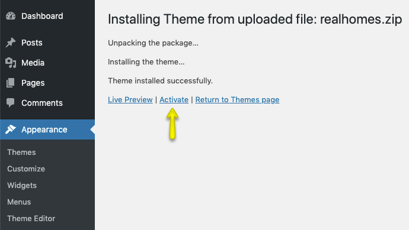

# Installation

Before installation, you must make sure that your hosting environment/server must meet the [requirements of WordPress](https://wordpress.org/about/requirements/). RealHomes doesn't requirement any specific setup and it will work perfectly fine on a hosting account (shared, reseller or dedicated) that meets WordPress requirements.

To start you must have a working version of WordPress. Almost all major web hosts provide one-click WordPress install and you can consult your host's help site for more information in this regard. For manual installation, you can consult [WordPress Official Installation guide](https://wordpress.org/support/article/how-to-install-wordpress/).

Once you have a working version of WordPress, You need to download "**All Files and Documentation**" from themeforest download page (screenshot below) and extract the downloaded zip to get the required files including **realhomes.zip**.

## Install Theme Via WordPress Dashboard ( _Recommended_ )

### **Upload realhomes.zip & Activate**

Go to **Appearance → Themes** section and click **Add New**

Click **Upload Theme**

Choose the **realhomes.zip** file and press **Install Now**

Once the theme is uploaded then you need to activate it.

### **Select Design Variation**

- Once you activated the theme, you will be redirected to the RealHomes welcome page. Here you select your desired design variation and click the **Save Changes** button. 

For more details please check [Design Selection](design-selection.md) page.

### **Activate Your License**

- Also, a notice will be displayed at the top of welcome page asking you to **Enter Item Purchase Code** and then click on the **Verify** button. RealHomes purchase verification allows you to **install plugins, import demo contents** and avail **auto updates**. For help to retrieve RealHomes purchase code you can follow our knowledge base article on [How to Get Themeforest Item Purchase Code](https://support.inspirythemes.com/knowledgebase/how-to-get-themeforest-item-purchase-code/) 

### **Required Plugin Installation & Activation**

- After **RealHomes Purchase Verification**, a notice will be displayed at the top asking you to install and activate the required plugins. So, go ahead and click on **Begin installing plugins**. 

- On next page you will see the list of plugins to install. Select all the plugins and click on **Install** and then click on **Apply** to install all of them at once (as shown in the screenshot below).  

- After all the plugins are installed click on **Return** to **Required Plugins Installer**.  

- Once again select all the plugins and click on **Activate** and then click on **Apply** to activate all the plugins and you are done.  

- After activation go to "**Real Homes → Customize Settings**" to play with theme's settings. You can also import the demo data before changing any settings in the Customizer. 

### **Update Permalinks Settings**

Go to **Dashboard → Settings → Permalinks** and choose **Post name** from **Common Settings** and save the changes, As displayed in screen shot below.

### **Initial Elementor Settings**

- Navigate to **Dashboard → Elementor → Settings** and make sure **Disable Default Colors** and **Disable Default Fonts** are enabled.

- In this same section, click on **Styles** and check the **Content Width** is set to **1240**.

if you face any problem during upload through dashboard, please upload the theme using FTP as guided below.

## Install Theme Via FTP ( Alternative Way )

1. Access your hosting server using an ftp client like **FileZilla**
2. Go to the '**wp-content → themes**' folder of your WordPress installation
3. Extract the **realhomes.zip** file and put the realhomes folder in '**wp-content → themes**' folder
4. Go to '**Dashboard → Appearance → Themes**' section to activate the theme
5. Go to **Dashboard → Settings → Permalinks** and choose **Post name** from **Common Settings** and save the changes.
6. After activation go to "**Dashboard → Real Homes → Customize Settings**" to play with theme's settings.

## Install Child Theme ( Highly Recommended )

It is highly recommended to use child theme, So that you can easily update parent theme whenever a new update becomes available. A pre-built ready to use child theme is included in the main theme pack that you have downloaded from themeforest.

To install child theme, You need to upload the **realhomes-child.zip** and activate it just like a normal WordPress Theme.

## **Common Installation Issues**

All of the following issues/errors are either user-created or server-side problems.

!!! error "**Theme is missing the style.css stylesheet error**"
    This issue occurs if you upload rh-main-package.zip file, check out this guide: https://help.market.envato.com/hc/en-us/articles/202821510-Theme-is-missing-the-style-css-stylesheet-error

!!! error "**The link you followed has expired**"
    This error happens if your hosting server is not configured with proper PHP parameters, you can find the solution in this guide: https://support.inspirythemes.com/knowledgebase/how-to-fix-the-link-you-followed-has-expired-in-wordpress/

!!! error "**Broken / Missing CSS Styles**"
    This problem only occurs if the theme directory doesn't have appropriate permissions, learn how you can fix it in this article: https://support.inspirythemes.com/knowledgebase/how-to-fix-broken-styles-after-installing-or-updating-the-theme/

!!! error "**Missing temporary directory**"
    You might also face this problem on some rare hosting servers if WordPress is not properly installed, so we have a solution in this quick guide: https://support.inspirythemes.com/knowledgebase/destination-directory-for-file-streaming-does-not-exist-or-is-not-writable/

If you face any other problem that is not listed above then [create a ticket](https://support.inspirythemes.com/ask-question/) at our support platform by [signing up](https://support.inspirythemes.com/login-register/) and we will assist you as soon as possible.