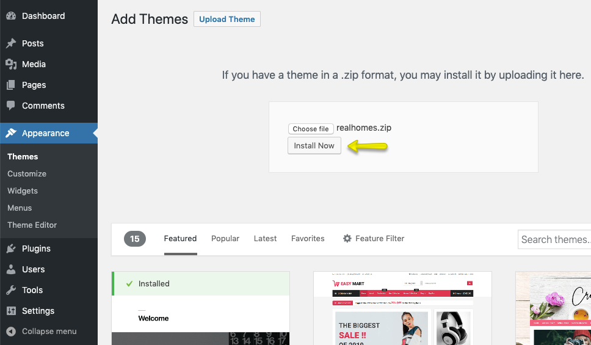
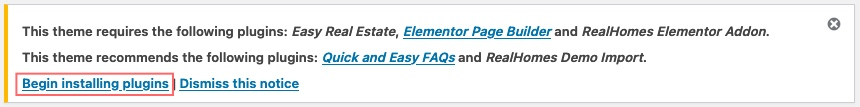
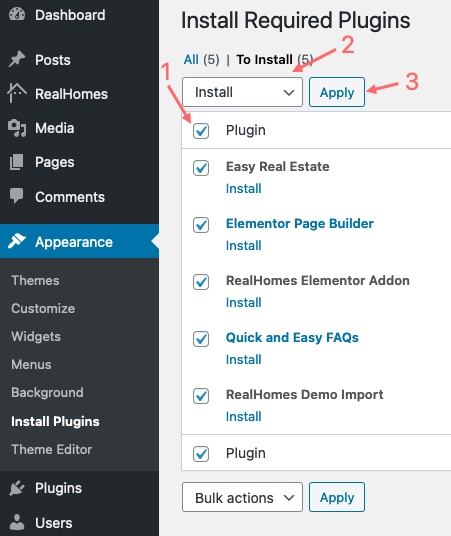

# Installation Guide

Welcome aboard! 🎉 We're really happy to have you with us. Let's get your new RealHomes site up and running.

Before we jump in, double-check that your hosting setup handles [WordPress requirements](https://wordpress.org/about/requirements/). RealHomes runs smoothly on pretty much any host, whether it's shared, dedicated, or something in between, as long as WordPress itself works fine.

---

## ✅ First Things First

You’ll need a fresh WordPress installation. Most hosting companies have a **one-click installer** in their control panel that makes this super easy. If you're setting it up yourself, the official [WordPress Installation Guide](https://wordpress.org/support/article/how-to-install-wordpress/) is your best friend.

Once WordPress is ready, head to your ThemeForest account and download the **“All Files and Documentation”** package. Unzip that file on your computer. Inside, look for `realhomes.zip`. That's the actual theme file you'll be uploading.

!!! warning "Heads Up: Don't Upload the Wrong File!"
    A common mistake is trying to upload the big zip file you downloaded from ThemeForest. That won't work. Make sure you extract it first and only upload `realhomes.zip`.

---

## 📦 Install via WordPress Dashboard (The Easy Way)

This is the method we recommend because it's usually the quickest.

### Step 1: Upload and Activate

1.  Go to your WordPress dashboard, navigate to **Appearance → Themes**, and click that **Add New** button at the top.

    

2.  Click the **Upload Theme** button.

    

3.  Select the `realhomes.zip` file we found earlier and hit **Install Now**.

    

4.  When it finishes, click **Activate** to switch on the theme.

    

---

### Step 2: Choose Your Style

As soon as you activate, you'll see the **RealHomes Welcome Page**. This is where you pick the layout that fits your vision: **Ultra**, **Modern**, or **Classic**.

Just click the one you like and hit **Save Changes**.

> Stuck on which one to pick? Take a look at our [Design Selection Guide](design-selection.md) for a quick comparison.

---

### Step 3: Activate Your License

To get all the good stuff (like automatic updates and premium plugins), you'll need to verify your purchase.

1.  Find the license box on the welcome screen.
2.  Paste in your **Item Purchase Code**.
3.  Click **Verify**.

And that's it! exact features are now unlocked.

Can't find your code? Here's how to grab it:
👉 [How to Get Your ThemeForest Purchase Code](https://support.inspirythemes.com/knowledgebase/how-to-get-themeforest-item-purchase-code/)

---

### Step 4: Install the Plugins

Now the theme will let you know which plugins it needs to function.

1.  Click on **Begin installing plugins**.

    

2.  Tick the box to **Select All** plugins.
3.  In the dropdown, chose **Install** and click **Apply**.

    

4.  When they're done, perform a quick checks, then click **Return to Required Plugins Installer**.

    

5.  Select them all again.
6.  This time, choose **Activate** in the dropdown and click **Apply**.

    

---

### Step 5: Fix Your Links (Permalinks)

We need to make sure your URL structure looks good for Google and makes sense to humans.

1.  Go to **Settings → Permalinks**.
2.  Choose **Post name**.
3.  Hit **Save Changes**.

---

### Step 6: Tweak Elementor

If you're using Elementor, let's make sure it plays nicely with RealHomes styles.

1.  Go to **Elementor → Settings**.
2.  On the **General** tab, check these two boxes:
    -   ✅ **Disable Default Colors**
    -   ✅ **Disable Default Fonts**
3.  Click **Save Changes**.

---

## 🛠️ FTP Installation (The Backup Plan)

If the dashboard upload is giving you trouble (sometimes file size limits get in the way), FTP is a solid alternative.

1.  Open your favorite FTP client (like **FileZilla**).
2.  Connect to your server and find the `/wp-content/themes/` folder.
3.  Unzip `realhomes.zip` on your computer first.
4.  Upload the entire extracted `realhomes` folder into that themes folder.
5.  Head back to your WordPress **Dashboard → Appearance → Themes** and activate RealHomes there.
6.  From there, just follow **Step 2**, **Step 3**, and **Step 4** above to finish up.

---

## 👶 Using a Child Theme

If you're planning to customize code or add your own CSS, please use the **Child Theme**. It keeps your changes safe so they aren't wiped out when you update the main theme later.

You'll find `realhomes-child.zip` in your download package. Just install and activate it exactly the same way you did the main theme.

---

## ⚠️ Troubleshooting Common Hiccups

Here are a few things that trip people up sometimes:

**"Missing style.css" error**
> This almost always means you uploaded the whole package file instead of just the theme zip.
> 👉 [How to fix it](https://help.market.envato.com/hc/en-us/articles/202821510-Theme-is-missing-the-style-css-stylesheet-error)

**"Link has expired"**
> This is usually your server saying the file is too big for its current settings. You'll need to increase your PHP upload limits.
> 👉 [How to increase limits](https://support.inspirythemes.com/knowledgebase/how-to-fix-the-link-you-followed-has-expired-in-wordpress/)

**Styles looking broken?**
> Often a permissions issue on the server folders.
> 👉 [Fix file permissions](https://support.inspirythemes.com/knowledgebase/how-to-fix-broken-styles-after-installing-or-updating-the-theme/)

**"Missing temporary directory"**
> This is a server setup thing. Your hosting support can fix this in a jiffy.
> 👉 [Read more](https://support.inspirythemes.com/knowledgebase/destination-directory-for-file-streaming-does-not-exist-or-is-not-writable/)

---

## ❓ Still Stuck?

If something weird is happening that's not listed here, just drop us a line on our **[Support Platform](https://support.inspirythemes.com/ask-question/)**. We're happy to help you sort it out!