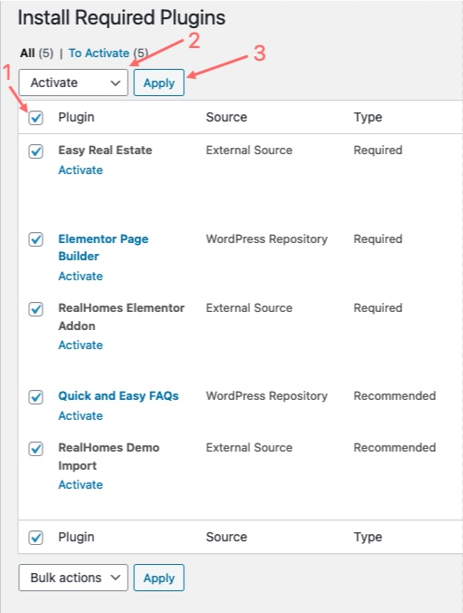

# Installation Guide

Welcome aboard! 🎉 Let's get your RealHomes theme up and running.

Before you dive in, make sure your hosting environment meets the official [WordPress requirements](https://wordpress.org/about/requirements/). RealHomes works seamlessly on most hosting types—shared, reseller, or dedicated—as long as WordPress runs properly.

---

## ✅ Before You Begin

You'll need a working WordPress installation first. Most web hosts offer **one-click WordPress installs**. If you’re installing manually, follow this [WordPress Installation Guide](https://wordpress.org/support/article/how-to-install-wordpress/).

Once WordPress is set up, download the **“All Files and Documentation”** package from ThemeForest and extract it. Inside, you'll find the key file: `realhomes.zip`.

---

## 📦 Install the Theme via WordPress Dashboard (_Recommended_)

### Step 1: Upload and Activate

1. Go to **Appearance → Themes → Add New**
2. Click **Upload Theme**
3. Select `realhomes.zip` and click **Install Now**
4. Once installed, click **Activate**

---

### Step 2: Select a Design Variation

After activation, you’ll land on the **RealHomes Welcome Page**. Select your preferred design variation (Ultra, Modern, or Classic), then click **Save Changes**.

> For a breakdown of each design, visit [Design Selection](design-selection.md)

---

### Step 3: Activate Your License

To unlock the full potential of RealHomes:

- Enter your **Item Purchase Code**
- Click **Verify**

This step enables access to **demo import, plugin installation**, and **auto-updates**.

Need help finding your code? Check out our guide:  
👉 [How to Get ThemeForest Purchase Code](https://support.inspirythemes.com/knowledgebase/how-to-get-themeforest-item-purchase-code/)

---

### Step 4: Install Required Plugins

After license verification, you'll be prompted to install plugins.

1. Click **Begin installing plugins**
2. On the next screen, **select all**, choose **Install**, and click **Apply**
3. After installation, click **Return to Required Plugins Installer**
4. Now, select all again, choose **Activate**, and click **Apply**

---

### Step 5: Set Permalinks

For clean, SEO-friendly URLs, navigate to:

**Dashboard → Settings → Permalinks**  
Select **Post name** and save.

---

### Step 6: Elementor Initial Settings

Ensure compatibility with theme styles:

**Dashboard → Elementor → Settings**  
Enable both:
- ✅ Disable Default Colors  
- ✅ Disable Default Fonts

---

## 🛠️ Alternate Installation Method: FTP

If you're facing upload issues, try FTP:

1. Connect to your server via an FTP client (e.g., FileZilla)
2. Navigate to `wp-content/themes/`
3. Extract `realhomes.zip` and upload the folder here
4. Activate the theme from **Dashboard → Appearance → Themes**
5. Set permalinks to **Post name**
6. Head to **RealHomes → Customize Settings** to start configuring

---

## 👶 Install the Child Theme _(Highly Recommended)_

Planning code-level customizations? Install the pre-built `realhomes-child.zip` file included in your download package. Upload and activate it just like the main theme.

---

## ⚠️ Common Installation Issues

These are the most frequently encountered issues and their fixes:

!!! error "**Theme is missing the style.css stylesheet error**"  
    Happens if you upload the full download package. Make sure to upload `realhomes.zip`.  
    👉 [Fix it here](https://help.market.envato.com/hc/en-us/articles/202821510-Theme-is-missing-the-style-css-stylesheet-error)

!!! error "**The link you followed has expired**"  
    Your server's PHP limits are too low.  
    👉 [Learn how to fix it](https://support.inspirythemes.com/knowledgebase/how-to-fix-the-link-you-followed-has-expired-in-wordpress/)

!!! error "**Broken or missing styles**"  
    Usually caused by incorrect file/folder permissions.  
    👉 [Fix broken styles](https://support.inspirythemes.com/knowledgebase/how-to-fix-broken-styles-after-installing-or-updating-the-theme/)

!!! error "**Missing temporary directory**"  
    A server misconfiguration.  
    👉 [Learn more](https://support.inspirythemes.com/knowledgebase/destination-directory-for-file-streaming-does-not-exist-or-is-not-writable/)

---

## ❓ Need Help?

If you face any issue not listed above, [submit a support ticket](https://support.inspirythemes.com/ask-question/) and our team will be happy to assist you.  
Don’t forget to [sign up or log in](https://support.inspirythemes.com/login-register/) first.

---