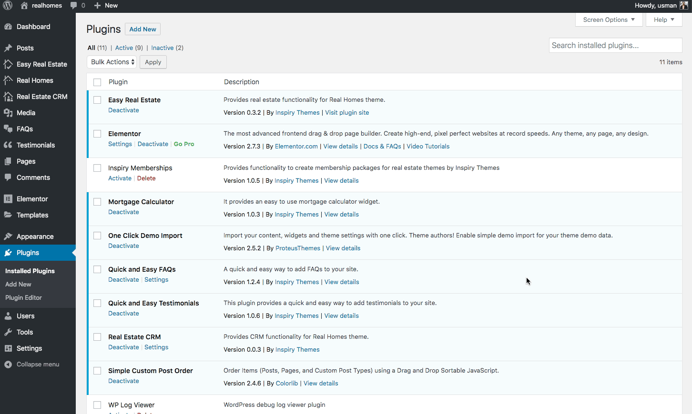
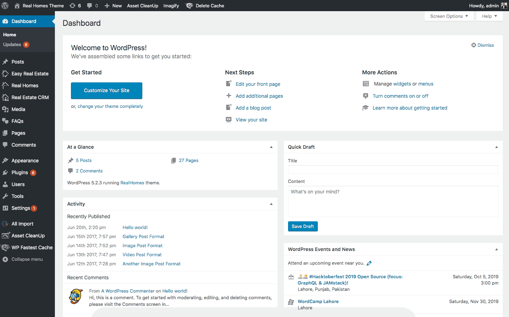

# What is Elementor?

## Introduction of Elementor

Elementor is the ultimate and FREE WordPress page builder plugin, which lets you create beautiful pages in the easiest and quickest way possible.

## Elementor with RealHomes Theme

RealHomes provide Elementor support and comes with **52 Real Estate Elementor Widgets** (via **RealHomes Elementor Addon plugin**) that you can use to build custom pages based on Elementor page builder.

RealHomes also includes pre-built Elementor based demo import that you can use to quickly get started on your project. **RealHomes Elementor Addon** can be installed via **Dashboard &rarr; Appearance &rarr; Install Plugins** section.

## Elementor Page Builder Plugin Installation

If you have activated all the required plugins during theme installation the **Elementor Page Builder plugin** was installed already. If not, then follow the steps below.

- Navigate to **Dashboard → Plugins → Add New** and find **Elementor Page Builder**.

- Once found, **Install** and **Activate** it.

- After installing and activating the **Elementor Page Builder plugin**. Go to **Dashboard → Appearance → Install Plugins** and install and activate **RealHomes Elementor Addon plugin**.

