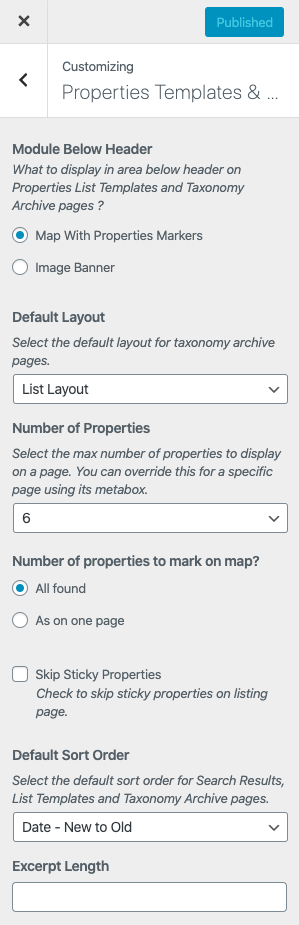

# **Listing & Archive Global Settings**

If you like to change any other global setting on Properties Listing or Archive pages then you can control several options by navigating to **Dashboard → RealHomes → Customize Settings → Properties Templates & Archives** as shown below.

#### **Ultra**

#### **Modern**

#### **Classic**

