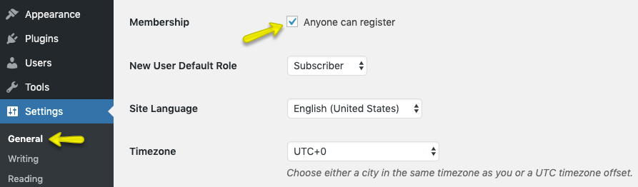
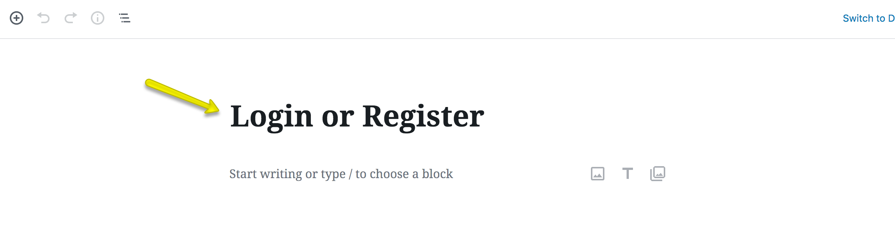
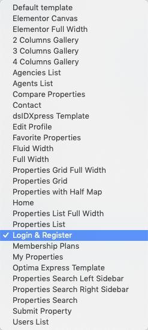
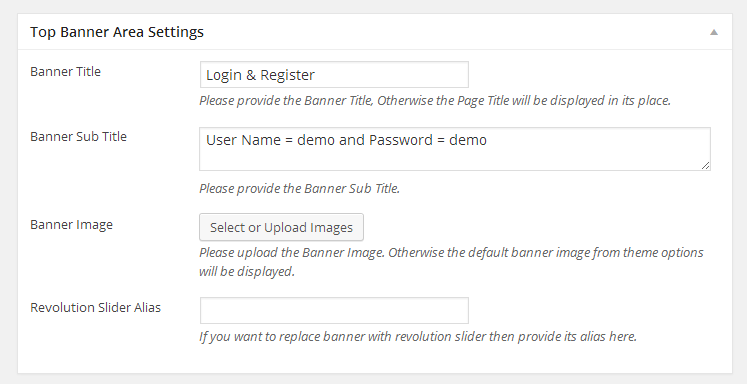
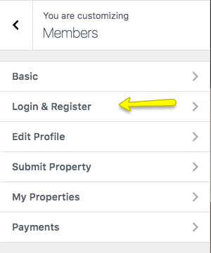
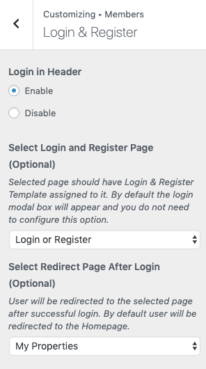

# Setup Login & Registration

## Allow Registration

To allow user registration, You need to allow registration from **Settings → General** as displayed in screen shot below. Otherwise you will only have login form available for use.

!!! warning "Important"
     Since Version 1.6 Real Homes theme automatically provides modal dialog for Login and Registration. So you do not need to follow further details of this section if you are good with using modal dialog.

## Create Login & Register Page

!!! note
    If you have imported demo contents then Login & Register page might already be created. But you still need to configure related settings as guided near the end of this section.

To add Login & Register page, Go to **Dashboard → Pages → Add New**

Provide the page title

Select the **Login & Register** template from page attributes.
 

Provide the top banner related information 

Publish the page once it is ready.

## Configure Settings

Now you need to go to **Dashboard → Real Homes → Customize Settings** and look for **Members** panel.

Look for Login & Register Section in that panel.

Now select the Login & Register page that has been created earlier as shown in image below.

Publish the settings and your Login & Register page is ready for use.
