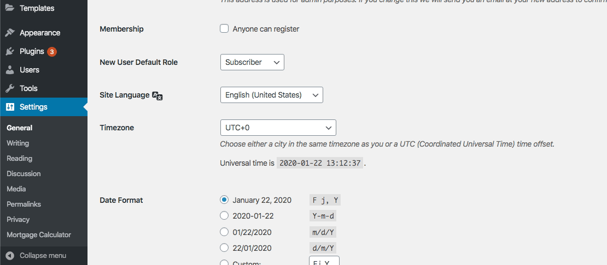
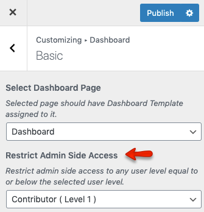

# Setup Login & Registration

## Allow Registration

To allow user registration, you need to check the **Anyone can register** option from **Dashboard → Settings → General** page and *Save Changes* as displayed in the following screenshot. Otherwise only Login form will be available for the users.

## Restrict Backend Access

You must restrict backend access of the user level which you have setup in the previous setup. So navigate to **Dashboard → Real Homes → Customize Settings → Members → Basic** and select **Contributor** (or the user role you have selected) for the first option (shown in the following screenshot).

## Create Login & Register Page

!!! note
    If you have imported demo contents then Login & Register page might already be created. But you still need to configure related settings as guided near the end of this section.

To add Login & Register page, Go to **Dashboard → Pages → Add New**

Provide the page title

Select the **Login & Register** template from page attributes.
 

Provide the top banner related information 

**Classic**

**Modern**

Publish the page once it is ready.

## Configure Settings

Now you need to go to **Dashboard → Real Homes → Customize Settings -> Header ** and go to **Login & Register Basics** section.

Now select the **Login Or Register** page that has been created earlier as shown in image below.

Publish the settings and your **Login & Register** page is ready for use.

## Redirect Users after Login

You can also redirect the users once they have logged in. The settings are found in **Dashboard → Real Homes → Customize Settings → Header  → Login & Register Basics**.

## Login Dialog Box Options

You can customize the login dialog box. The settings are found in **Dashboard → Real Homes → Customize Settings → Header  → Login & Register Dialog**. 

!!! note
    Dialog box will appear if no page is select in **Dashboard → Real Homes → Customize Settings -> Header -> Login & Register Basics** ==Login and Register Page (optional)== field.
    

## User and Agent/Agency Synchronization

Synchronization between WordPress Users and Real Estate Agent/Agency can be enabled by navigating to the **User & Agent/Agency Sync** section under the same **Members** panel. After enabling it, the system will automatically add a new agent/agency for a newly registered user and related agent/agency information will be updated with an update in user information. It will work vice versa for users when new agent or agency will be added or updated.

