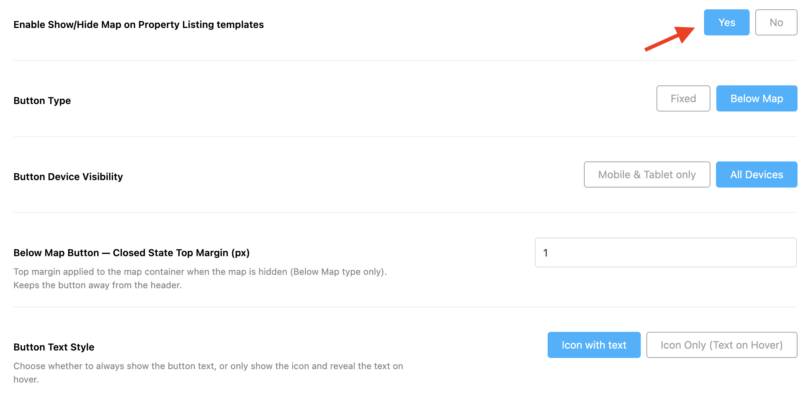
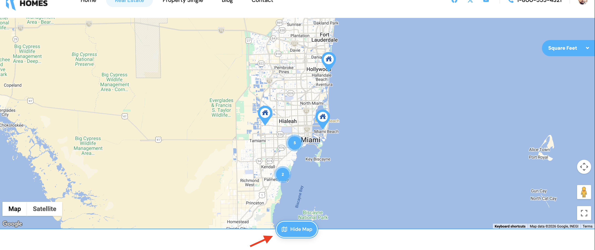
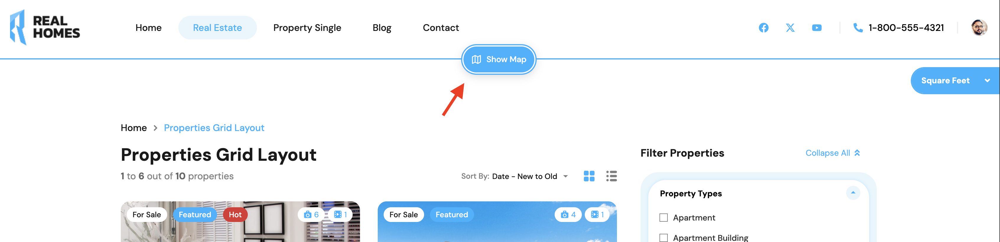
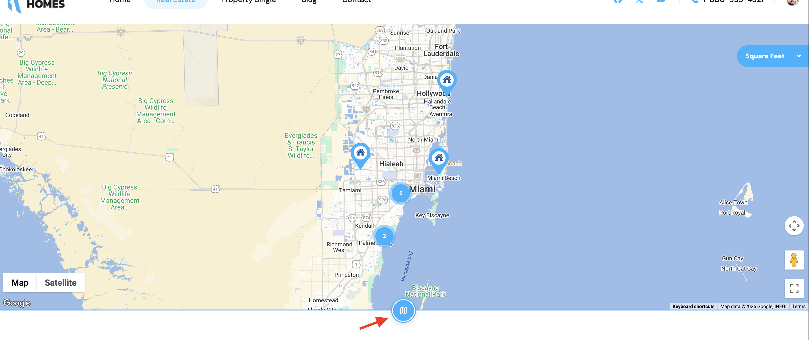

# **Map Show/Hide Feature for Property Listing Pages**

RealHomes now includes a flexible **Map Show/Hide** feature for property listing templates, allowing visitors to choose whether they want to browse properties using the map view or focus entirely on the property listings.

This feature is particularly useful for users who prefer a distraction-free browsing experience or who are working on smaller screens where additional space for property listings is valuable.

You can enable this feature from:

Dashboard ➤ RealHomes ➤ Settings ➤ Maps

Then enable the option **Enable Show/Hide Map on Property Listing Templates**.

---

### **How It Works**

Once enabled, a toggle button will appear on property listing pages that display a map.

Visitors can:

- **Hide the map** to maximize the space available for property listings and search results.
- **Show the map again** whenever they want to explore properties geographically.
- Switch between map and listing-focused browsing without reloading the page.

When the map is hidden, the listing page becomes cleaner and more focused on property cards, filters, and search results.

When the map is displayed, users can continue exploring listings visually through map markers and geographic locations.

---

### **Persistent User Preference**

The selected map state is automatically saved using the browser's **Local Storage**.

This means that if a visitor chooses to hide the map:

- The preference is remembered automatically.
- Other property listing pages across the website will respect the same preference.
- The visitor does not need to hide the map repeatedly on every page.
- The preference remains active even after navigating to different listing templates or refreshing the page.

Similarly, if the visitor chooses to show the map, that preference is also remembered throughout their browsing session and future visits on the same browser.

!!! tip "Smart User Experience"
    RealHomes remembers each visitor's preference individually using their browser's local storage. No additional setup is required, and the preference does not affect other visitors to your website.

---

#### **Available Configuration Options**

In addition to enabling the feature, you can customize how the map toggle behaves.

##### **Button Type**

Choose how the toggle button is displayed:

- **Fixed** – The button remains fixed and easily accessible while browsing.
- **Below Map** – The button is positioned directly beneath the map area.

##### **Button Device Visibility**

Control where the toggle button appears:

- **All Devices** – Display the button on desktops, tablets, and mobile devices.
- **Mobile & Tablet Only** – Display the button only on smaller screens.

This can be especially useful if you want desktop visitors to always see the map while providing mobile users with the flexibility to hide it.

##### **Below Map Button Closed State Top Margin**

When using the **Below Map** button type, you can define the top margin applied when the map is hidden.

This helps maintain proper spacing and prevents the toggle button from appearing too close to the website header.

##### **Button Text Style**

Choose how the button label is displayed:

- **Icon with Text** – Always display both the icon and text label.
- **Icon Only (Text on Hover)** – Display only the icon by default and reveal the text when the user hovers over it.

This option allows you to keep the interface minimal while still maintaining usability.

---

#### **Frontend Examples**

#### **Map Visible State**

When the map is enabled, visitors can browse properties using both the map and listing results simultaneously.

##### **Map Hidden State**

When the map is hidden, the page layout becomes more compact and focused on property listings.

##### **Icon Only Button Style**

For websites that prefer a cleaner appearance, the toggle button can be displayed as an icon only.

---

#### **Recommended Usage**

We recommend enabling this feature on websites that:

- Display large property inventories.
- Rely heavily on map-based search.
- Serve mobile-first audiences.
- Want to provide visitors with greater control over the browsing experience.
- Use full-width map layouts on property listing pages.

The Map Show/Hide feature helps create a more personalized browsing experience by allowing visitors to decide how they want to explore your property listings.