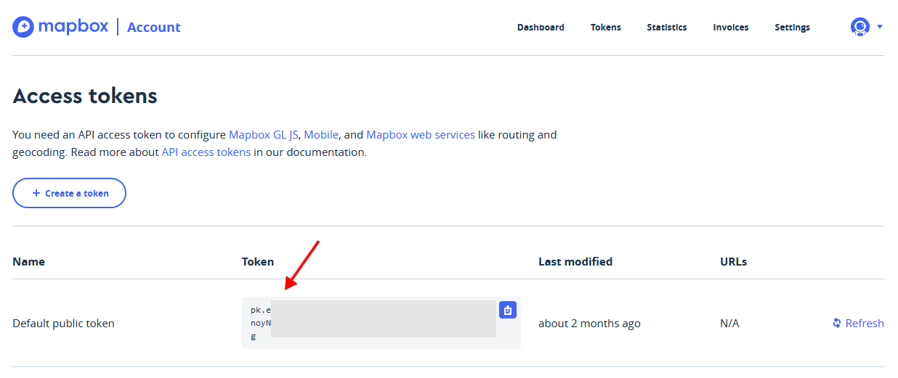
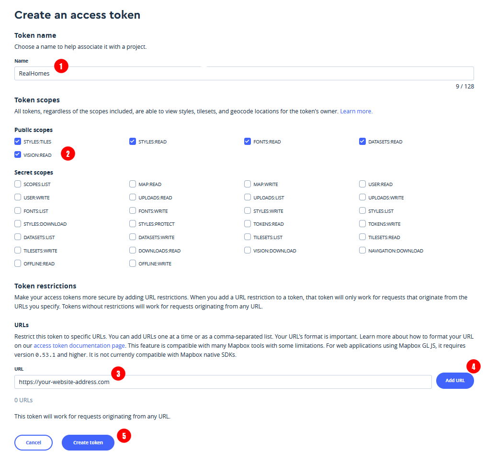
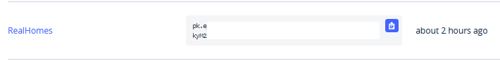
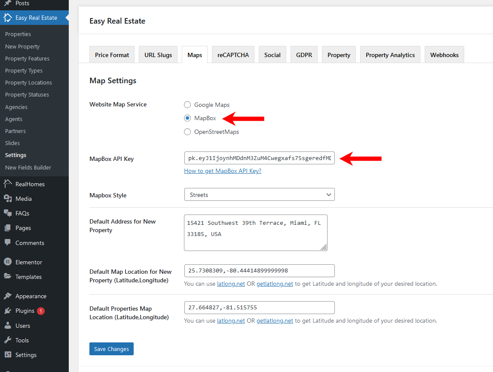

# How to setup MapBox API for your website

### **Sign Up & Login**

Please go to [**MapBox Sign Up page**](https://account.mapbox.com/auth/signup/) and sign up if you don't have an account or login with your mapbox account.

### **Select Default Public Token**

You should see a **Default Public Token** on the first page after login which you can use on your website to activate MapBox service.

### **Create a new Token**

If you like to create a new token of MapBox for your website then click on **+ Create Token** button.

1. Provide a **Name** of your website for MapBox Token.
2. Select the highlighted permissions in the **Token scopes** (if not already selected).
3. Type your full website address to restrict the token to your website only for security.
4. Click **Add URL** to add the website address.
5. Click **Create Token** to proceed.
6. You should see your newly created token on the next screen.

### **Copy the Token and Add it to Maps Settings**

Copy the **MapBox Token** by clicking on the blue icon. Navigate to **Easy Real Estate → Settings → Maps** and select **MapBox** from **Website Map Service** and paste this **Token** you just copied to **MapBox API Key**.

### **Default Location for Maps on Single Property & Property Listing Pages**

In this **Maps** settings tab, you can also provide the default location for *New Property Map* and *Properties Listing Map* (when there is no property to display).

!!! info "Important Information"
    If you are running the RealHomes Theme older than {==3.9.0==} version then related settings can be found by navigating to **Dashboard → Real Homes → Customize Settings → Map**. It is strongly recommend to update the theme to its latest version.