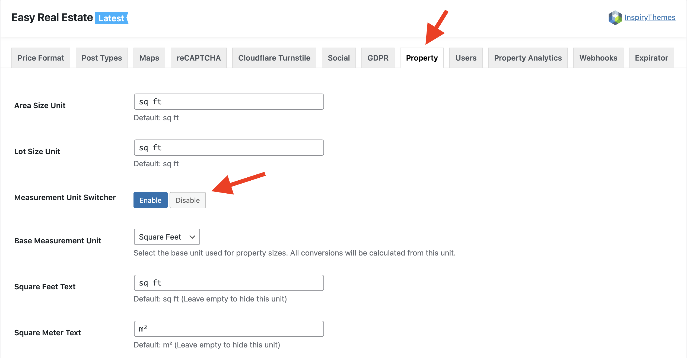
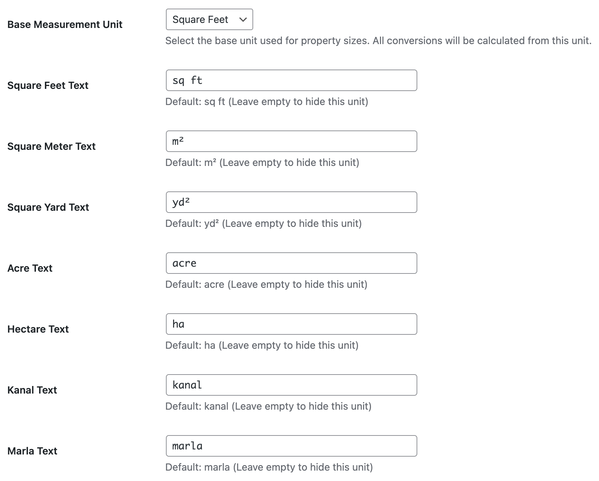

# Measurement Unit Switcher

The **Measurement Unit Switcher** allows your website visitors to view property area and lot sizes in their preferred measurement unit (e.g., Square Feet, Square Meters, Acres). When enabled, a dropdown or toggle will appear on the frontend properties, automatically calculating the conversions based on your configured base unit.

!!! info "Design Availability"
    The **Measurement Unit Switcher** is supported on the **Modern** and **Ultra** design variations. It is not available for the **Classic** design.

---

## Configuring Measurement Units

To configure the measurement units and the switcher, navigate to **Dashboard → Easy Real Estate → Settings → Property**.

### Area & Lot Size Units

If you only want to use a single format across your entire website (without the switcher), you can define a static text label:

*   **Area Size Unit**: Enter the default area unit text (e.g., `sq ft`).
*   **Lot Size Unit**: Enter the default lot size unit text (e.g., `sq ft`).

### Measurement Unit Switcher

If you are using the **Modern** or **Ultra** design, you can enable the dynamic unit switcher. Select **Enable** to turn on the feature.

---

## Base Unit & Customizing Unit Labels

Immediately below the unit switcher toggle, you will find settings to define your base unit and customize the labels for all available measurement formulas.

### Base Measurement Unit
Select the measurement unit you used when entering your property sizes in the backend. All mathematical conversions for the frontend switcher will be calculated from this base unit.

*   *Example:* If you select "Square Feet", and enter a property size as `1000`, the system knows this means 1,000 sq ft and will accurately convert it to square meters other othe units dynamically.

### Customizing Display Labels
You can also modify the display labels for each available measurement unit. **If a unit's text field is left empty, that specific unit will be hidden** from the frontend switcher dropdown.

The available units and their default texts are:

*   **Square Feet Text**: Default is `sq ft`
*   **Square Meter Text**: Default is `m²`
*   **Square Yard Text**: Default is `yd²`
*   **Acre Text**: Default is `acre`
*   **Hectare Text**: Default is `ha`
*   **Kanal Text**: Default is `kanal`
*   **Marla Text**: Default is `marla`

After making your changes, make sure to click **Save Changes** at the bottom of the page.
