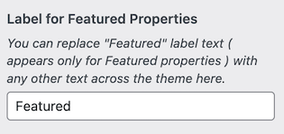
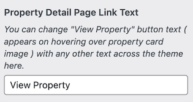
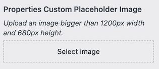
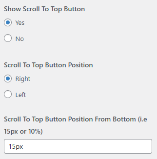
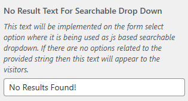
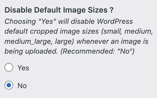
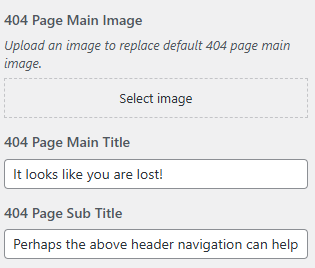

# Misc Settings

Navigate to **Dashboard → RealHomes → Customize Settings → Misc** to manage various global settings that enhance user experience and interface behavior across your website.

---

### **Label for Featured Properties**
Customize the label text that appears on featured properties throughout the theme.  
Example: Change **"Featured"** to something like **"Top Pick"**, **"Hot"**, or any term that matches your branding.

---

### **Property Detail Page Link Text**
Change the text of the button that links to the property detail page (displayed when hovering over a property card image).  
Example: Replace **"View Property"** with **"Explore"** or **"See Details"**.

---

### **Properties Custom Placeholder Image**
Upload a default image to be shown for properties that don't have a featured image.  
**Recommended Size:** At least **1200px width** and **680px height**.

---

### **Scroll to Top Button**
Manage the visibility and placement of the scroll-to-top button on your website.

- **Show Scroll to Top Button**: Toggle to enable or disable the button.
- **Scroll to Top Button Position**: Choose whether it appears on the **right** or **left** side.
- **Scroll to Top Button Position From Bottom**: Set the vertical spacing from the bottom using a value like `15px` or `10%`.

---

### **No Result Text for Searchable Dropdowns**
Set the fallback text shown when no matching results are found in searchable dropdowns (e.g., location or features).  
Example: *"No Results Found!"*

---

### **Disable Default Image Sizes**
Enable this option if you want to stop WordPress from generating its default image sizes (small, medium, large, etc.) when uploading new images.  
**Recommended Setting:** Keep this **disabled (No)** unless you have a specific reason to reduce image variants.

---

### **404 Page Settings**
Customize the appearance and message of the 404 page (shown when a user lands on a non-existing URL).

- **404 Page Main Image**: Upload a custom image for the 404 error page.
- **404 Page Main Title**: Set the main message (e.g., *"It looks like you are lost!"*).
- **404 Page Sub Title**: Add a supporting message (e.g., *"Perhaps the above header navigation can help."*).

