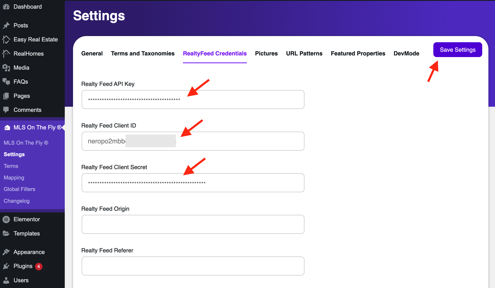

# Setting up MLS On The Fly™ with RealHomes

The **MLS On The Fly™** compatibility is added to RealHomes in v4.4.3. The **MLS On The Fly™** integration allows you to bring MLS listings directly into your **RealHomes-powered website**. This makes it possible to display real-time MLS data seamlessly alongside your manually added listings.  

It is powered by **Realtyna’s MLS Router™ API** and supports both **WordPress** and **React/Next.js** platforms. RealHomes fully supports this integration out of the box, and we provide a dedicated demo so you can preview how MLS listings look with RealHomes.

👉 **Explore it here**: [**RealHomes MLS Demo**](https://demo.realhomes.io/mls)

---

## Prerequisites
Before you begin, ensure the following:

1. An active **MLS On The Fly™ subscription** with Realtyna.  
   - Depending on your MLS provider, a setup fee and recurring cost may apply.  
2. **API credentials** issued by Realtyna after registration.  
3. The **RealHomes Theme v4.4.x or later** installed and activated on your WordPress site.

---

## Step 1: Get Your API Credentials
- Sign up via the Realtyna Dashboard to obtain your API Key.  
- Follow this guide from Realtyna: [How to Sign Up on RealtyFeed Dashboard](https://support.realtyna.com/index.php?/Knowledgebase/Article/View/862/0/how-to-sign-up-on-realtyfeed-dashboard)  

<video width="100%" height="525" controls="controls">
<source src="https://realtyna.com/wp-content/uploads/RealtyFeed%20Dashboard%20Introduction%20-%2009-13-2024.mp4" type="video/mp4"></video>

---

## Step 2: Install MLS On The Fly™ Plugin
1. From the WordPress **Admin Dashboard → Plugins → Add New**.  
2. Upload and install the **MLS On The Fly™ plugin** (download link provided in your Realtyna confirmation email).  
3. Click **Activate** once installation completes.  

For a detailed guide from Realtyna, you can also refer to:  
👉 [How to Setup MLS On The Fly™ on Your Website](https://support.realtyna.com/index.php?/Knowledgebase/Article/View/863/0/how-to-setup-mls-on-the-fly-on-your-website)

---

## Step 3: Configure the Plugin in RealHomes
1. Go to **WordPress Dashboard → MLS On The Fly™ → Settings**.  
2. Switch to the **RealtyFeed Credentials** tab.  
3. Enter the **Client ID** and **Client Secret** from Step 1.  
4. Save your changes.  

---

## Step 4: Display MLS Listings with RealHomes
Once configured, MLS listings will sync and appear automatically in your **Properties Page** within RealHomes.  

- RealHomes will merge MLS listings into the standard property layout, ensuring a consistent design.  
- You can use RealHomes templates and widgets (like Property Grid, Search Forms, and Property Detail pages) to present MLS listings in the same polished format as your manually added properties.  
- Refresh your **Properties Page** to see the synced MLS listings.  

👉 **See it in action on the RealHomes MLS Demo:** [https://demo.realhomes.io/mls](https://demo.realhomes.io/mls)

---

## Summary
By combining **RealHomes** with **MLS On The Fly™**, you can create a professional real estate website that displays both your own listings and MLS listings in a unified, customizable design.  

This ensures:  
- Real-time MLS property updates.  
- Seamless styling consistent with the RealHomes theme.  
- A better experience for both agents and visitors.