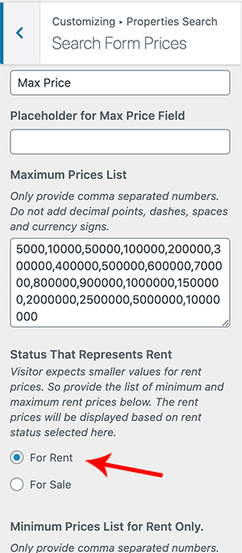
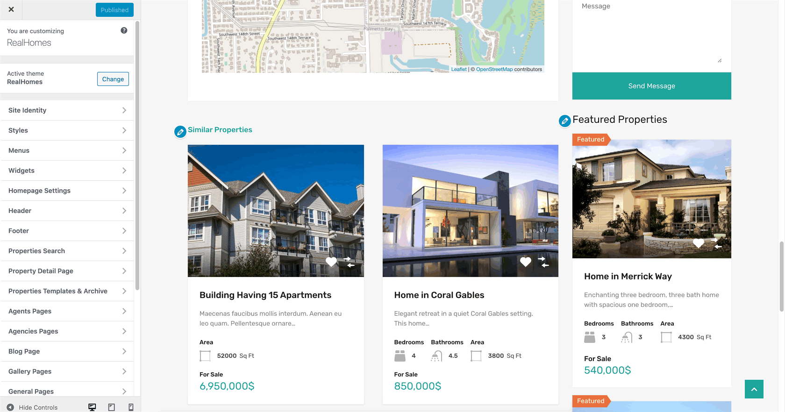
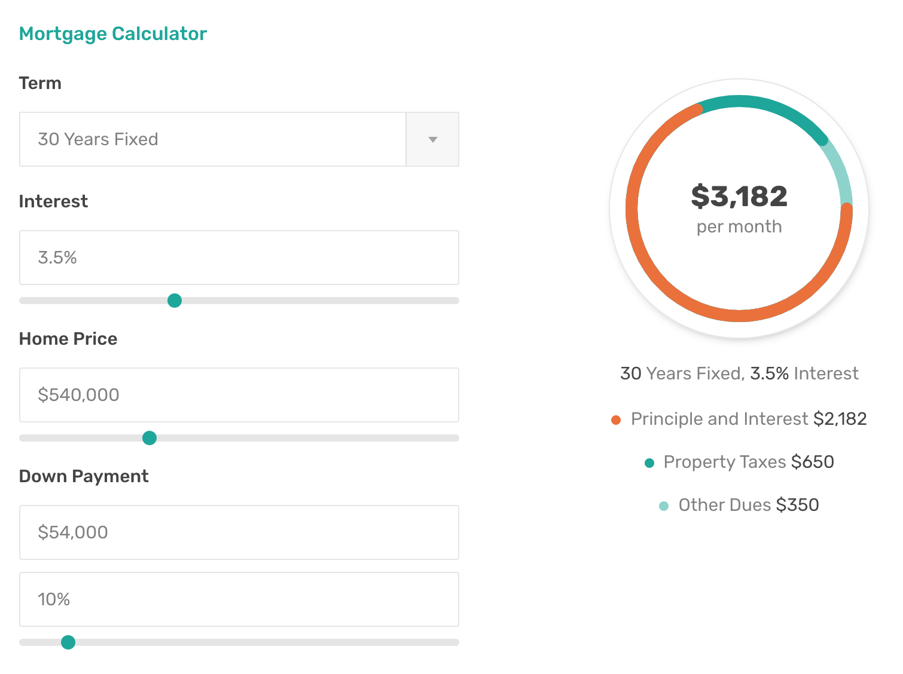
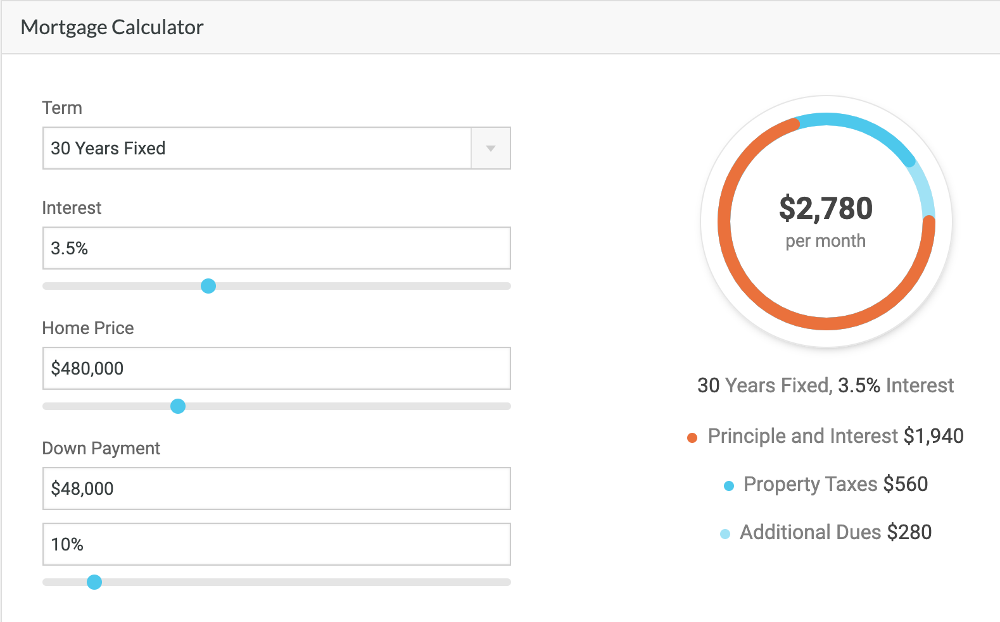
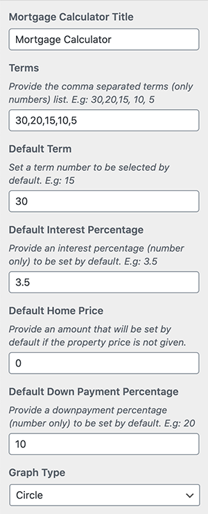
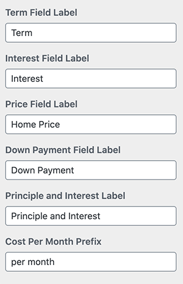
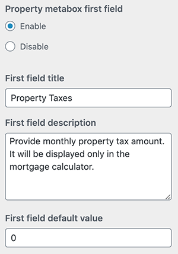
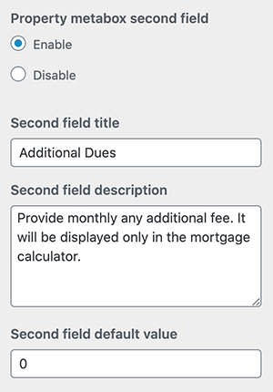

# Mortgage Calculator Setup

!!! note
    If you have Imported Demo Contents the Mortgage Calculator is already active and you do not need to follow this section.

From RealHomes v3.11.1, the **Mortgage Calculator is now a part of the theme** and you don't have to install it as a separate plugin.

The new **Mortgage Calculator section/widget will only display for the Properties available for Rent**. The Rent status is determined from the Customizer settings shown in the following screenshot.

### **Activate Mortgage Calculator**

You can activate it from **Customizer** settings, navigate to **<code>Dashboard → RealHomes → Customize Settings → Property Detail Page → Mortgage Calculator</code>** section.

You should see it on the property detail page according to your selected design on the frontend. The Mortgage Calculator can be seen in the following screenshots.

**Modern**

**Classic**

### **Labels & Other Settings**

The Mortgage Calculator title, labels and other elements can be modified from the same Customizer settings (refer to the following screenshots).

### **Set Up Mortgage Calculator in previous version of RealHomes**

In RealHomes v3.11.0 or earlier the [Mortgage Calculator](https://wordpress.org/plugins/mortgage-calculator/) plugin can be installed to have Mortgage Calculator widget.

- Install and activate the [Mortgage Calculator](https://wordpress.org/plugins/mortgage-calculator/) plugin.

- After installing and activating the plugin. Go to **Dashboard → Settings → Mortgage Calculator** and configure currency settings. 

 

- After configuring the plugin's settings. Go to **Dashboard → Appearance → Widgets** and look for **Mortgage Calculator** widget and use that on **Property Sidebar** widget area. Provide it a title and save the widget settings.

- Now check out the front end of property detail page and you will have a mortgage widget working for you. 

**Classic**  

**Modern**  

