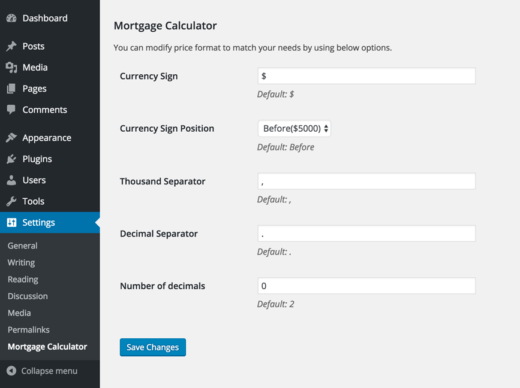
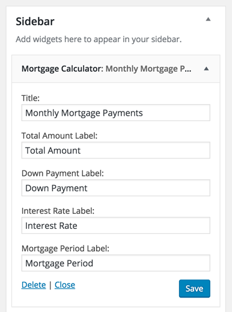
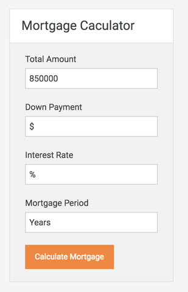
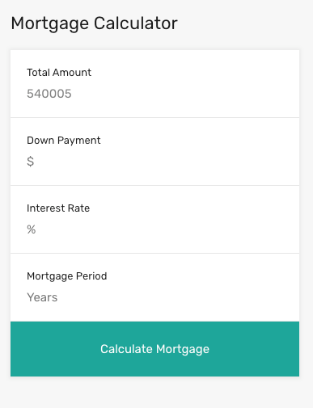

# How to set up Mortgage Calculator Widget

We will use [Mortgage Calculator](https://wordpress.org/plugins/mortgage-calculator/) plugin.

- Install and activate the [Mortgage Calculator](https://wordpress.org/plugins/mortgage-calculator/) plugin.

- After installing and activating the plugin. Go to **Dashboard → Settings → Mortgage Calculator** and configure currency settings. 

 

- After configuring the plugin's settings. Go to **Dashboard → Appearance → Widgets** and look for **Mortgage Calculator** widget and use that on **Property Sidebar** widget area. Provide it a title and save the widget settings.

- Now check out the front end of property detail page and you will have a mortgage widget working for you. 

**Classic**  

**Modern**  

