# Mortgage Calculator Setup

!!! note
    If you have Imported Demo Contents the Mortgage Calculator is already active and you do not need to follow this section.

From RealHomes v3.11.1, the **Mortgage Calculator is now a part of the theme** and you don't have to install it as a separate plugin.

### **Activate Mortgage Calculator Module**

You can activate it by navigating based on your version of the **RealHomes** theme:

=== "v4.5.1 and Later"

    !!! success "RealHomes Settings"
        Dashboard ➔ RealHomes ➔ Settings ➔ Property Detail Page ➔ Mortgage Calculator

    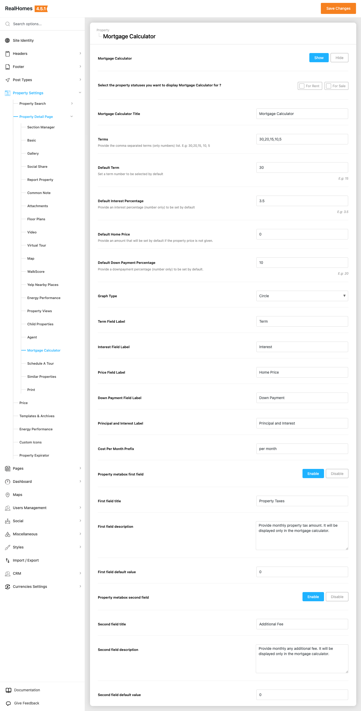

=== "v4.5.0 and Earlier"

    !!! info "Legacy Settings"
        Dashboard ➔ RealHomes ➔ Customize Settings ➔ Property Detail Page ➔ Mortgage Calculator

    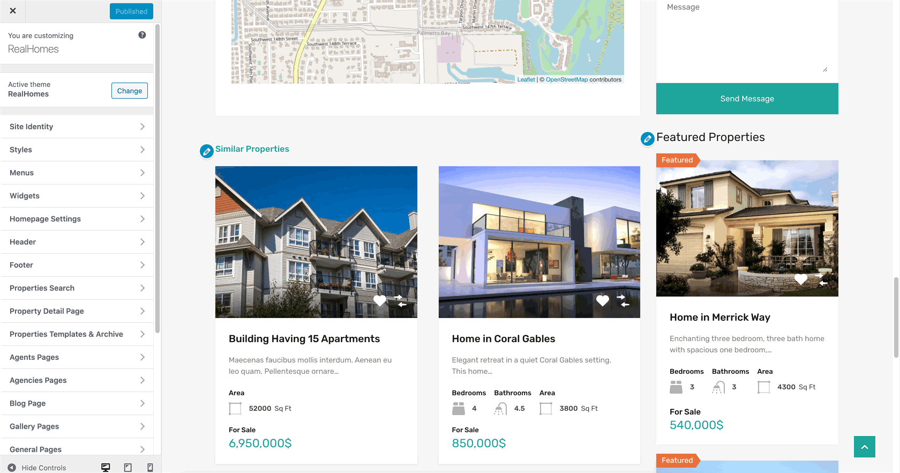

After activation of the Mortgage Calculator module you must re-save the section manager settings for property details page by going to:

=== "v4.5.1 and Later"

    !!! success "New Options Panel Path"
        Dashboard ➔ RealHomes ➔ Settings ➔ Property Detail Page ➔ Section Manager

    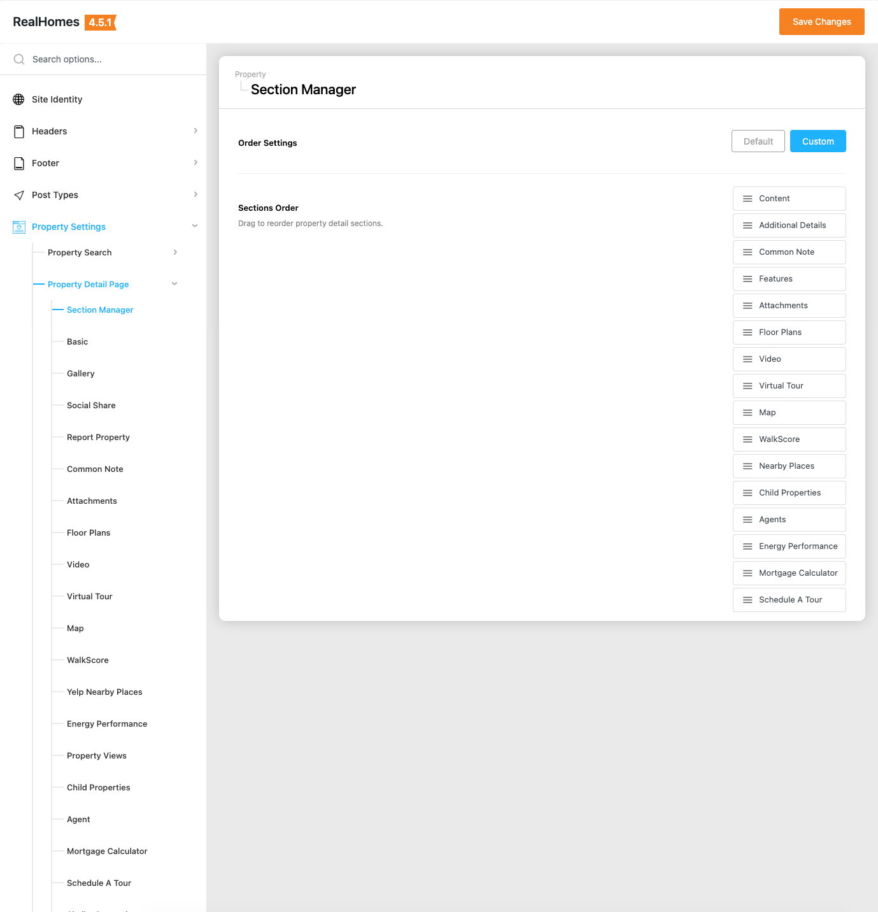

=== "v4.5.0 and Earlier"

    !!! info "Legacy Customizer Path"
        Dashboard ➔ RealHomes ➔ Customize Settings ➔ Property Detail Page ➔ Section Manager

    Change any of its settings and save it (check following demonstration).

    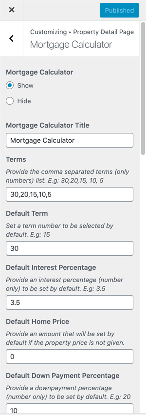

You should see it on the property detail page according to your selected design on the frontend. The Mortgage Calculator can be seen in the following screenshots.

**Modern**
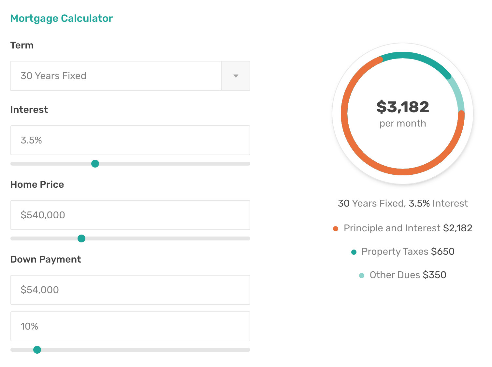

**Classic**
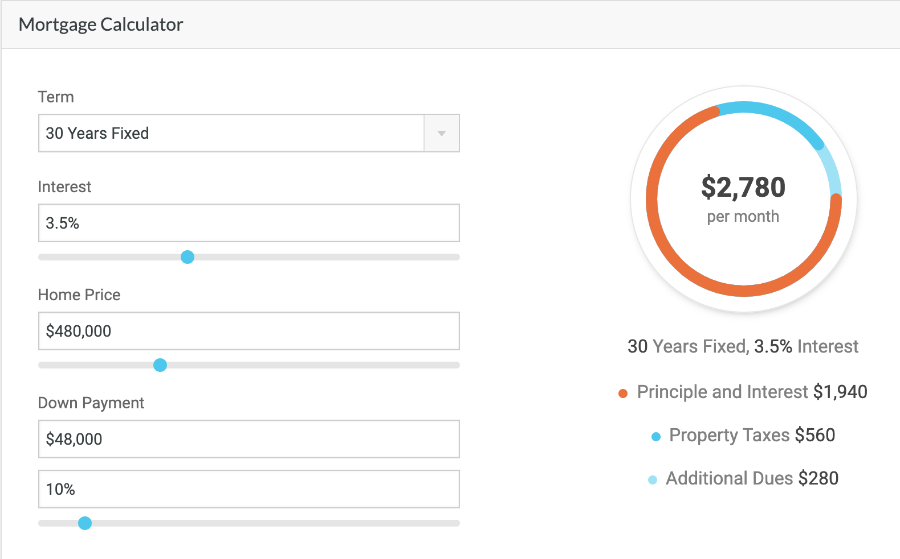

### Mortgage Calculator Widget

The new **Mortgage Calculator module is also available as a Widget** and you can add it to any sidebar of your choice throughout the theme.

**Modern**

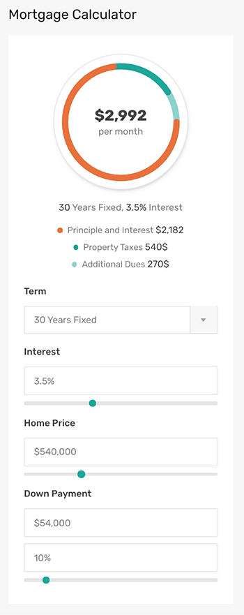

**Classic**

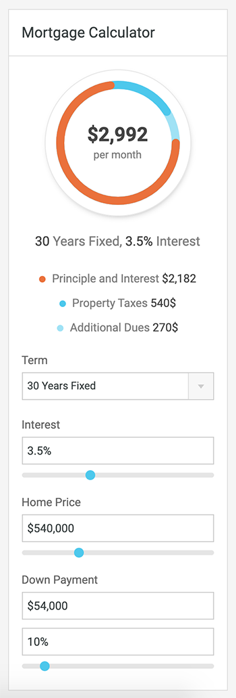

### **Labels & Other Settings**

The Mortgage Calculator title, labels and other elements can be modified from the same settings section mentioned above.

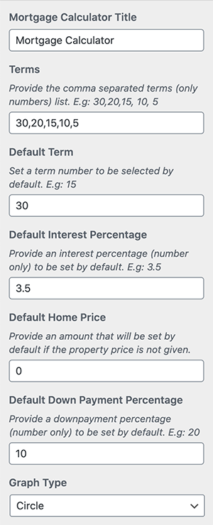

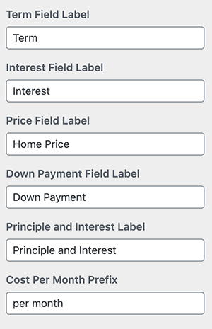

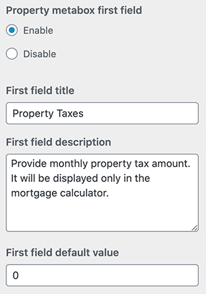

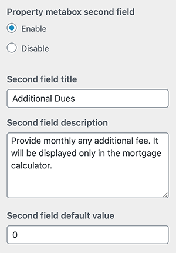

### **Property Meta Fields on Property Edit Screen**

The property meta fields to add taxes and dues can be found in the **Misc** section on **Property Edit Screen** (screenshot below).

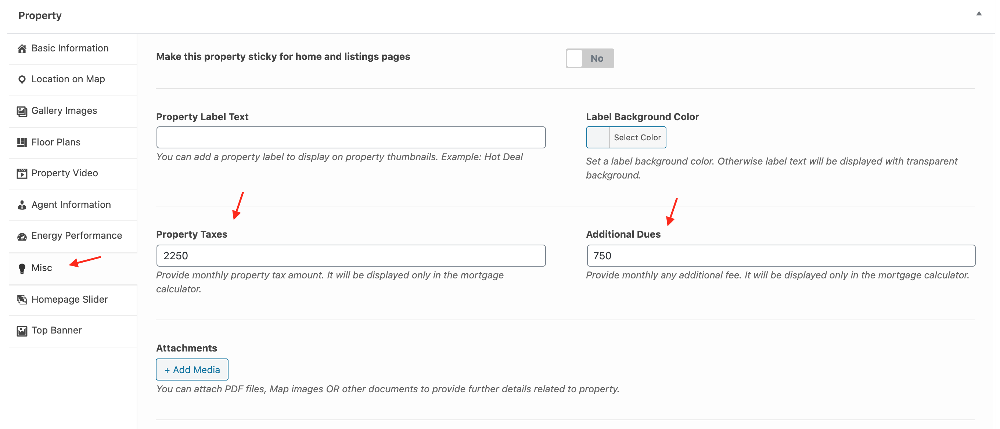

The new **Mortgage Calculator section/widget will not display for the Properties available for Rent**. The Rent status is determined from the settings shown in the following screenshot.

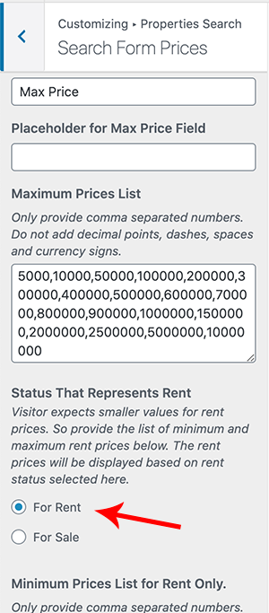

### **Set Up Mortgage Calculator in previous version of RealHomes**

In RealHomes v3.11.0 or earlier the [Mortgage Calculator](https://wordpress.org/plugins/mortgage-calculator/) plugin can be installed to have Mortgage Calculator widget.

- Install and activate the [Mortgage Calculator](https://wordpress.org/plugins/mortgage-calculator/) plugin.

- After installing and activating the plugin. Go to **Dashboard → Settings → Mortgage Calculator** and configure currency settings. 

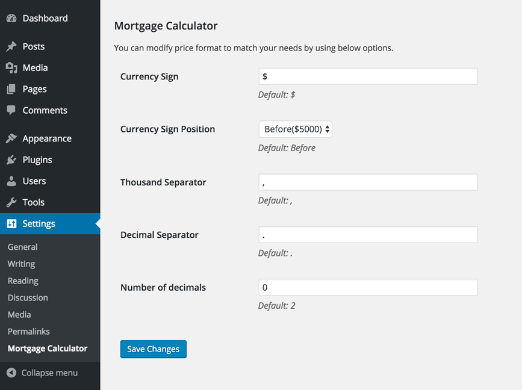 

- After configuring the plugin's settings. Go to **Dashboard → Appearance → Widgets** and look for **Mortgage Calculator** widget and use that on **Property Sidebar** widget area. Provide it a title and save the widget settings.

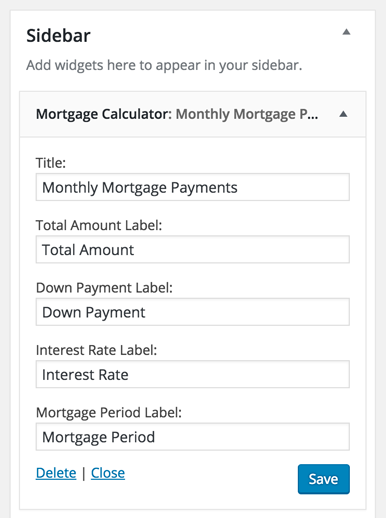

- Now check out the front end of property detail page and you will have a mortgage widget working for you. 

**Classic**  
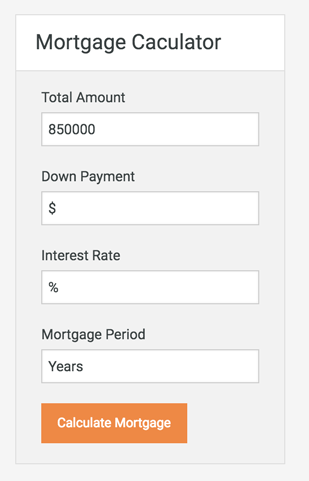

**Modern**  
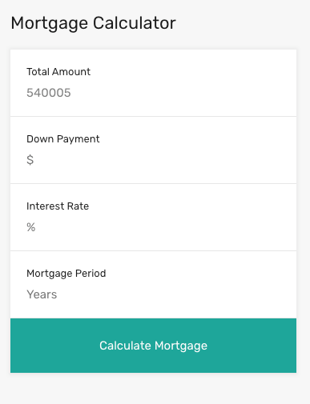
