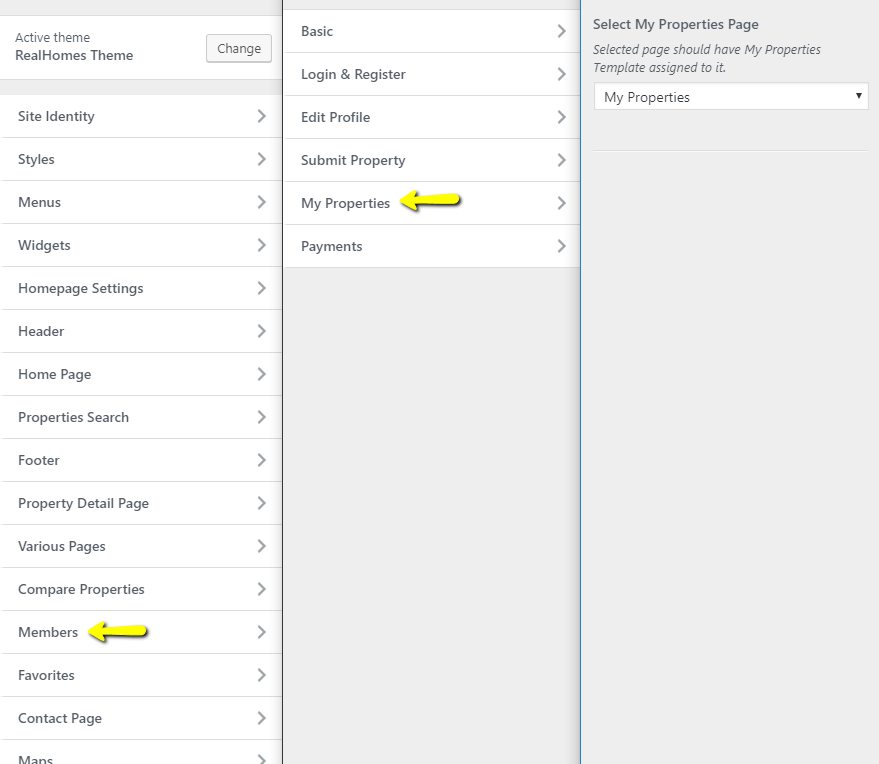

# My Properties Module

## Configure My Properties Settings

Navigate to **Dashboard → RealHomes → Customize Settings → Users & Members** and look for **My Properties** panel where you can configure related settings. **Select My Properties Page** from dropdown. You can also Show/Hide **My Properties Search Form** as displayed in screenshot below. 

Save the changes and your **My Properties** page is ready to use.

**Classic**

**Modern**

