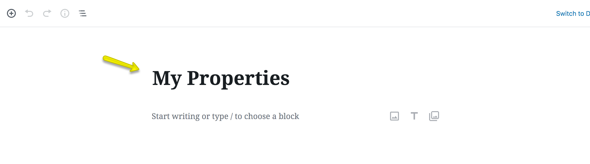

# Setup My Properties Page

## Create My Properties Page

!!! note
    If you have imported demo contents then My Properties page is already created. But you still need to configure related settings as guided below.

To add My Properties page, Go to **Dashboard → Pages → Add New**

Provide the page title
 

Select the **My Properties** template from page attributes.

Publish the page once it is ready.

## Configure My Properties Settings

Navigate to **Dashboard → Real Homes → Customize Settings → Members** and look for **My Properties** panel where you can configure related settings. **Select My Properties Page** from dropdown. You can also Show/Hide **My Properties Search Form** as displayed in screenshot below. 

Save the changes and your **My Properties** page is ready to use.

**Classic**

**Modern**

