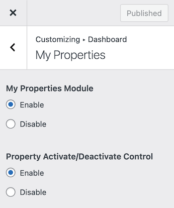
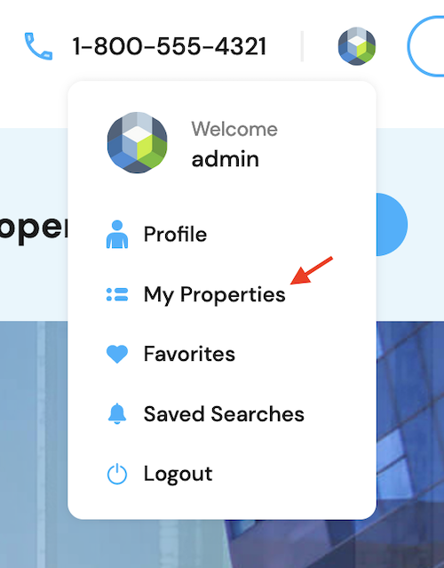
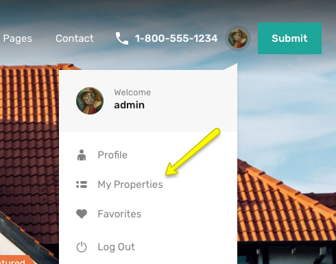
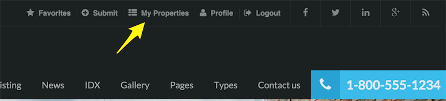
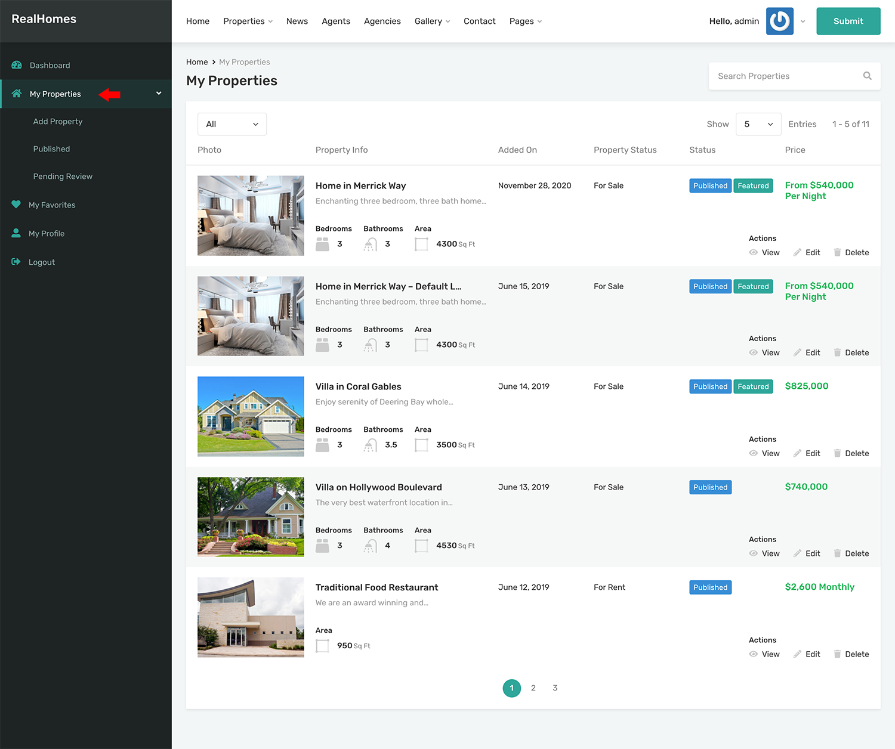

# My Properties

### ⚙️ **My Properties Settings**

To configure the **My Properties** section in the user dashboard, navigate to:

**Dashboard → RealHomes → Customize Settings → Dashboard → My Properties**

Within this Customizer panel, you can manage the following options:

- ✅ **Enable/Disable My Properties Module**  
  Toggle the visibility of the My Properties section for frontend users.

- 🔄 **Properties Activation/Deactivation**  
  Allow users to activate or deactivate their listed properties directly from the dashboard.

### 🏡 **My Properties in User Menu**

The **My Properties** section allows users to manage their submitted properties directly from the frontend dashboard. This interface is available across all design variations of the RealHomes theme:

- **Ultra Design**

  

- **Modern Design**

  

- **Classic Design**

  

### 🏘️ **My Properties in Dashboard**

Additionally, here's a view of the My Properties interface in the Dashboard:

