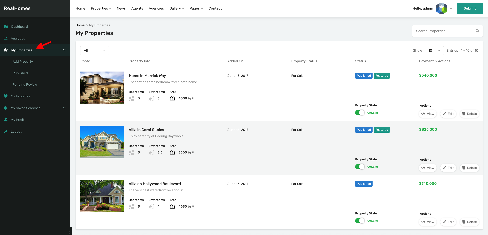

# My Properties

### ⚙️ **My Properties Settings**

To configure the **My Properties** section available in the user dashboard, go to:

**Dashboard → RealHomes → Customize Settings → Dashboard → My Properties**

From this Customizer panel, you can manage:

- ✅ **Enable/Disable My Properties Module**  
  Toggle the visibility of the My Properties tab for frontend users.

- 🔄 **Allow Users to Activate/Deactivate Properties**  
  Enable this option to let users manage the activation status of their submitted properties.

!!! info "Important"

    The **Activate/Deactivate Property** option will be disabled automatically if the **RealHomes Memberships** plugin is active on your website.

---

### 🏡 **My Properties – Frontend View**

The **My Properties** section in the user dashboard allows logged-in users to view, manage, and edit their submitted properties. This feature is consistent across all design variations of the RealHomes theme:

- **Ultra Design**

  

- **Modern Design**

  

- **Classic Design**

  

---

### 🖥️ **My Properties – Admin View**

Here is how the **My Properties** section appears in the admin-side Customizer:

