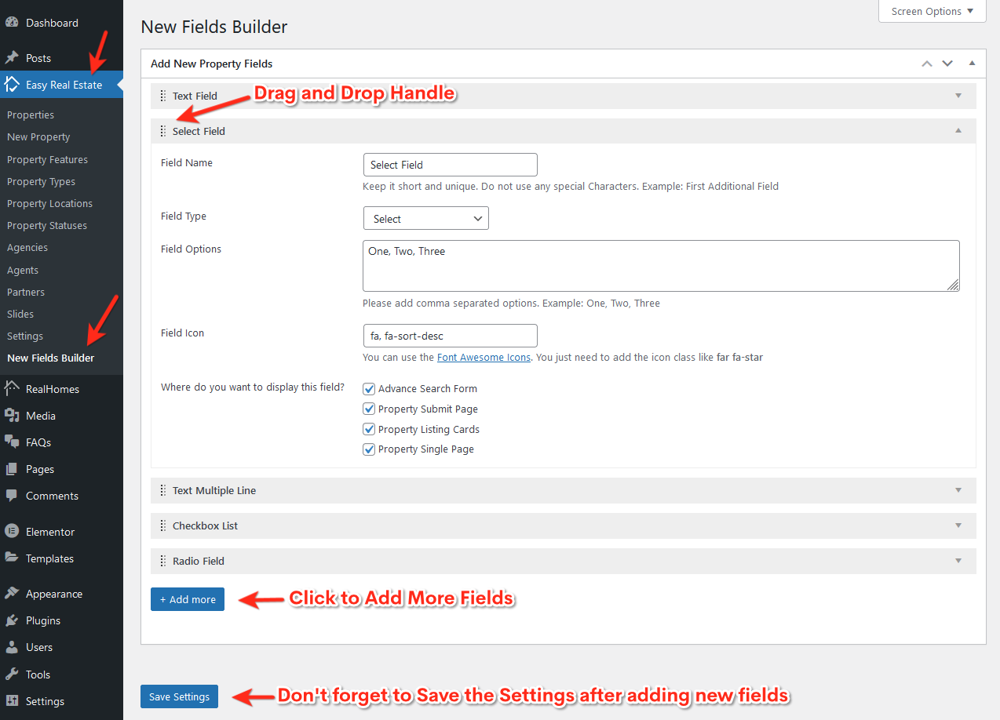

You can create new property fields that can be displayed in the **Advanced Search Form**, **Property Submit Form**, **Property Detail Page**, and other key locations of your site.

Navigate to **Dashboard → Easy Real Estate → New Fields Builder** as shown below:

### **New Fields Builder Guide**

- **Drag & Drop Fields**  
  You can rearrange fields using the drag-and-drop handle beside each field label.

- **Field Name & Type**  
  Enter a unique field name and select its type from options like `Select`, `Text`, `Radio`, `Checkbox`, and `Textarea`.

- **Multi-Select & Field Options**  
  For fields like **Select**, **Checkbox**, or **Radio**, enable multi-select if needed and provide comma-separated values (e.g., `One, Two, Three`) for the dropdown or options list.

- **Field Icon**  
  Add a Font Awesome icon class (e.g., `fa fa-sort-desc`) to visually represent the field.

- **Display Locations**  
  Choose where to display the field by selecting from:
    - Advanced Search Form
    - Property Submit Page
    - Property Listing Cards
    - Property Single Page
    - Property Compare Page
    - Property Filters Widget

- **Additional Field Types**  
  You can also add **Text Multiple Line**, **Checkbox List**, and **Radio Field** types using the **Add more** button.

- **Backup & Restore**  
  The "Additional Fields Backup" section allows you to export or import fields using a JSON structure. Copy the JSON to back up, or paste it to restore.

- **Save Settings**  
  After adding or editing fields, make sure to click the **Save Settings** button at the bottom of the page to apply your changes.

!!! warning "Important"

    The New Fields Builder was introduced in {==**RealHomes v3.10.0**==}. If you're using an older version of the theme, please update to access this feature.