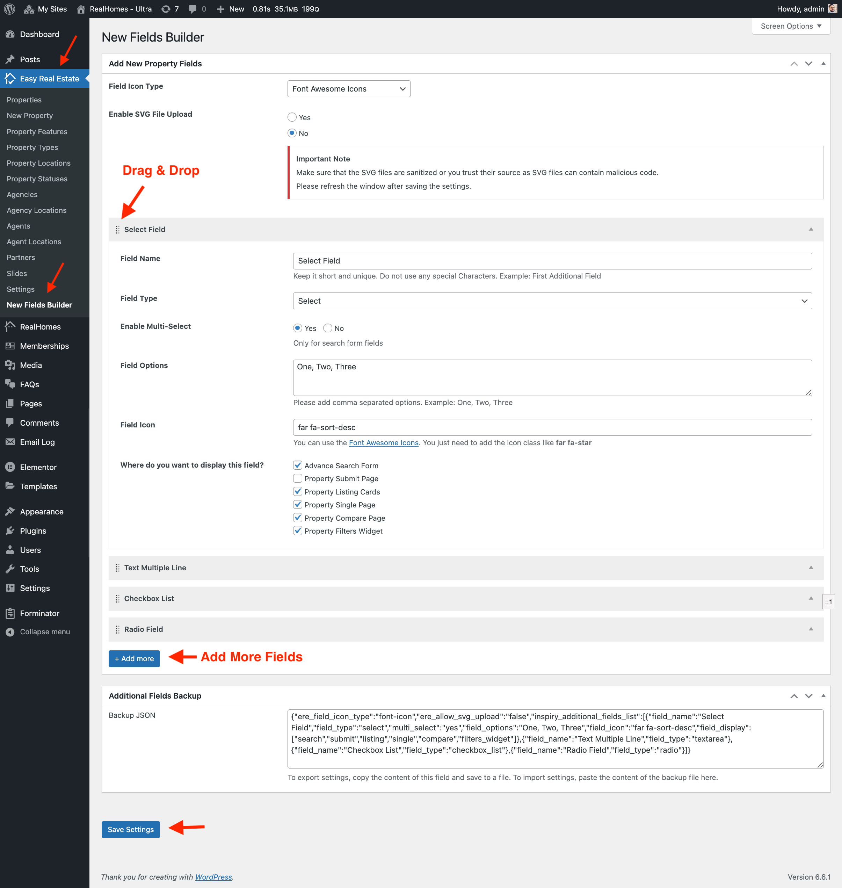

You can create new property fields that can be added to **Search Form**, **Property Submit Form** and **Property Detail Page** by navigating to the **Dashboard → Easy Real Estate → New Fields Builder** page as demonstrated in the following screenshot. 

### **New Fields Builder Guide**
- You can reorder a field by drag and drop handle that you can see near the field label.
- For the multi-option fields e.g *Checkbox*, *Radio* and *Select* you can add comma separated values to create lists.
- Don't forget to *Save Settings* once you are done with adding new fields.

!!! warning "Important"

    The **New Field Builder** is added in {==**v3.10.0**==} so if you have Real Homes Theme older than 3.10.0 then you must update it to the latest version to have it.