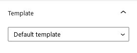

# Create and Configure News Page

## Create News Page

In case you have Imported Demo Contents the news page is already created and you do not need to follow this section.

To set up the News page you need to create a new page, Go to **Dashboard → Pages → Add New**. You can give this page a title as "**News**", you do not need to add any contents for now.

No template selection is necessary, as it requires **Default Template** as displayed below.

Click “**Publish**” to publish the page.

## Configure Reading Settings

I am assuming that you have already created a Home page.

To configure reading settings you need to visit **Dashboard → Settings → Reading** and choose that front page displays as static page. Then select **Home** as **FrontPage** and **News** as **Posts Page** (shown below)

## Banner and Spacing 

### **Modern**

### **Classic**

!!!info "More information about **Banner Settings** can be found here: "
    **https://support.inspirythemes.com/knowledgebase/how-to-configure-the-banner-settings/**

## Blog Page Header and Meta Settings

The header variation and blog meta settings are located in **Customizer** panel [ **Dashboard → RealHomes → Customize Settings → Blog Page** ].

