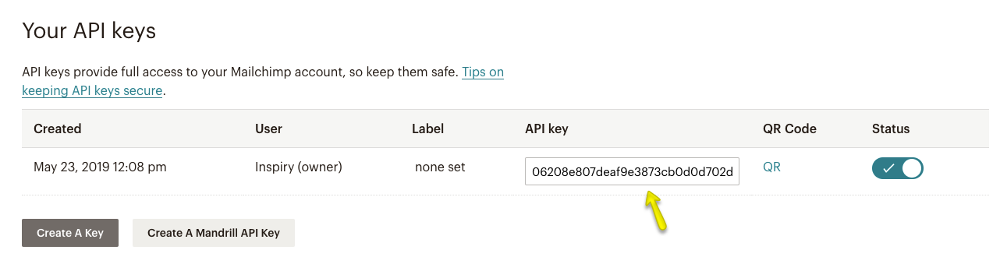
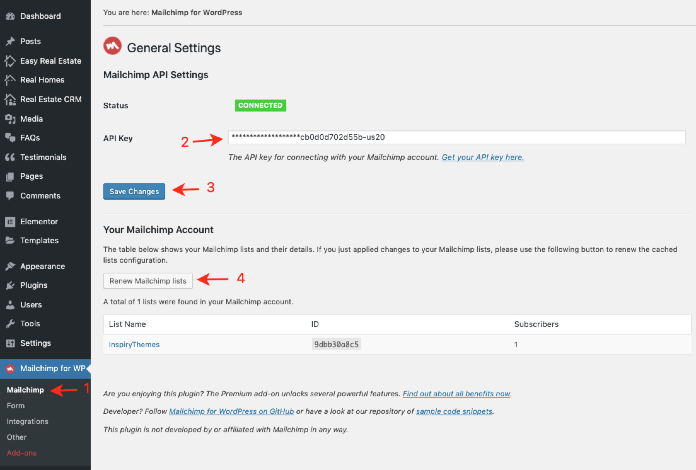
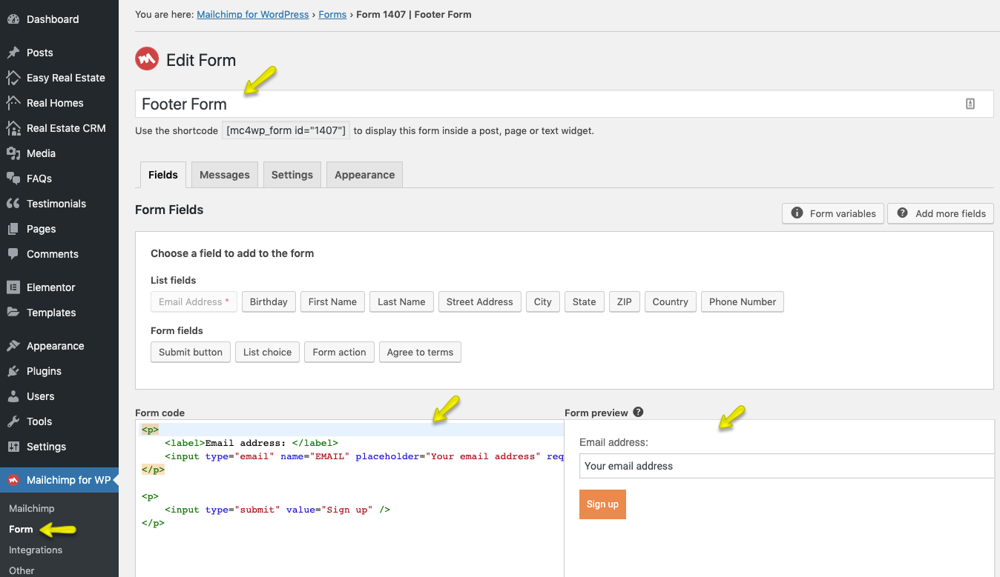
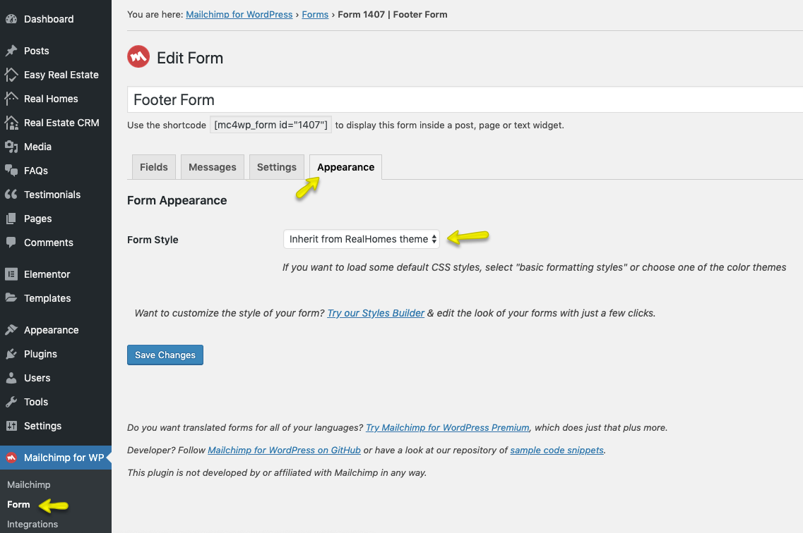
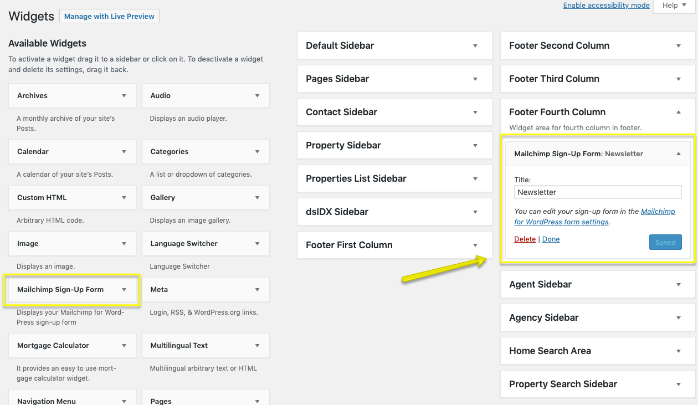

# How to set up Newsletter Widget

Newsletter widget uses [Mailchimp for WordPress](https://wordpress.org/plugins/mailchimp-for-wp/) plugin.

- Install and activate the [Mailchimp for WordPress](https://wordpress.org/plugins/mailchimp-for-wp/) plugin.

- Now, you need an API key. Login to your Mailchimp account and [get your API key here](https://admin.mailchimp.com/account/api). 

- After, creating an API Key, copy it as pointed in the following screenshot.

- Now, on your site navigate to **Dashboard → Mailchimp for WP → Mailchimp** page and add the copied Mailchimp API Key there.

- Once you renewed the Mailchimp lists, navigate to next page **Dashboard → Mailchimp for WP → Form** and create a form as guided in the following screenshot.

- To match the **Newsletter Widget** styles with Real Homes theme, ensure you have selected the **Inherit from RealHomes theme** option in the **Appearance** tab.

- **Final Step**: navigate to **Dashboard → Appearance → Widgets** page. Drag and drop the **Mailchimp Sign-Up Form** widget to the desired sidebar area.

