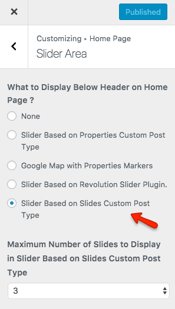
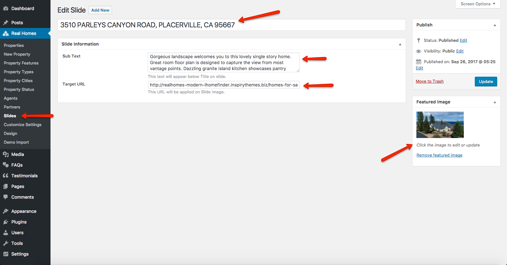
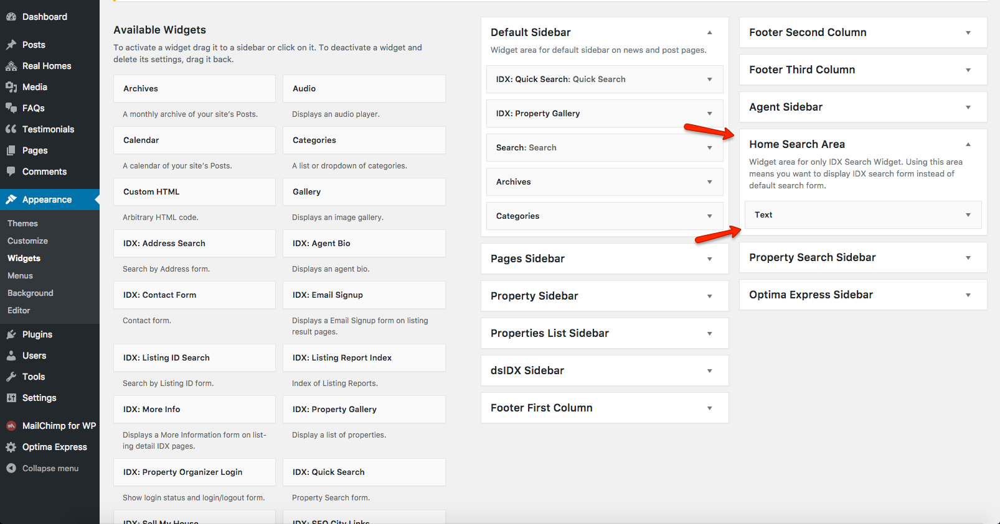
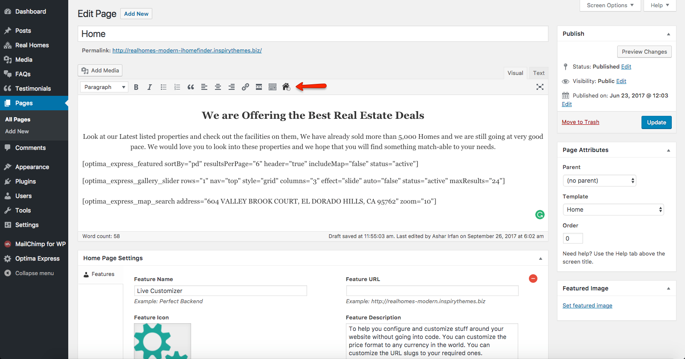
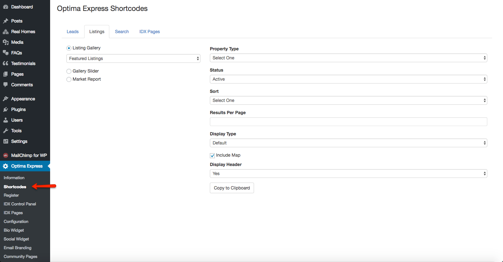
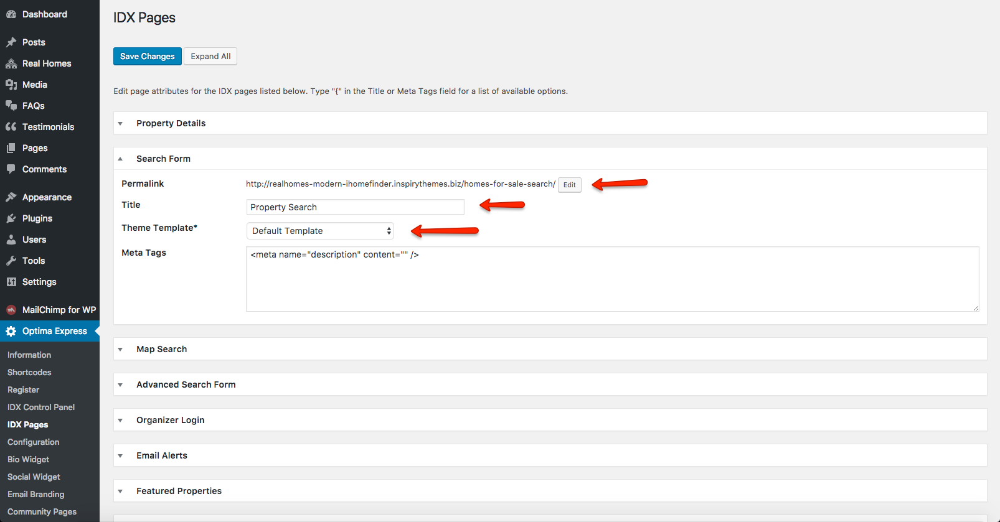
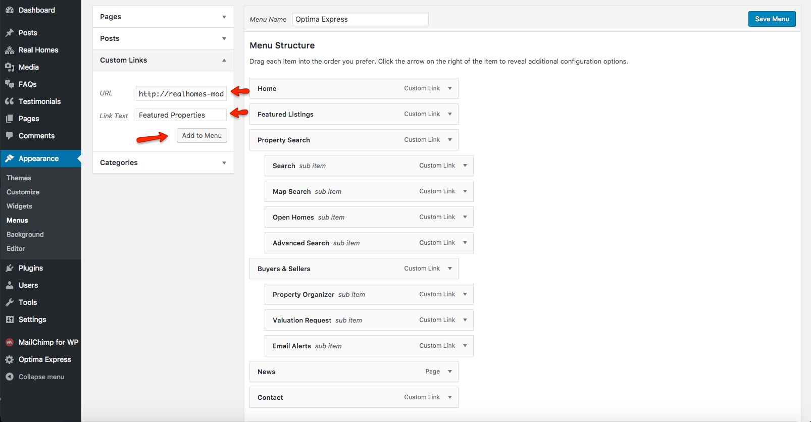

# iHomeFinder Optima Express Content Setup 

### **Creating Slider**

**iHomeFinder Optima Express** plugin doesn't provide any specific option to create dynamic slider so we will be using the option **Slider Based on Slides Custom Post Type**.

Follow the steps below to set it up.

1. Navigate to **Dashboard → Real Homes → Customize Settings → Home Page → Slider Area**.
 
2. Select **Slider Based on Slides Custom Post Type** option and save the settings by clicking on **Publish**. 

3. Navigate to **Dashboard → Real Homes → Slides** and click on Add New.

4. Enter the **Title**, **Description**, **Target Link** and set a **Featured Image** of the property as displayed in the following screenshot. 

5. After adding the content for the slide and setting up featured image click on **Publish**.

6. To create more slides repeat the steps from 1 to 5. 

### **Adding IDX Search Form to Home Page**

Follow the following instructions to add IDX Search Form to Home Page.

1. Navigate to **Dashboard → Appearance → Widgets**.

2. Add a **Text Widget** to **Home Search Area**. 

3. In the **Text Widget** copy and paste the following shortcode: 
`[optima_express_quick_search style="twoline" showPropertyType="true"]`

### **Shortcodes**

iHomeFinder Optima Express plugin allows you to create the shortcodes via **Optima Express Shortcode** option in **Visual Editor**.

 
You can also navigate to **Dashboard → Optima Express → Shortcodes** to copy the shortcode based on the options selected and use it anywhere (on a post or page).

### **Adding IDX Content to Home Page**

**iHomeFinder Optima Express** plugin provides multiple shortcodes as we mentioned above. So use the **Optima Express Shortcode** option (shown in the screenshot below) in **Visual Editor** to insert the shortcode of your choice and options.

You can click on the **Optima Express Shortcode** option to select the desired options for the content and then click on **Insert** button to insert the shortcode to the post/page of your choice.

### **Setting Up Other IDX Pages**

To set up other IDX pages, navigate to **Dashboard → Optima Express → IDX Pages** and make sure all the pages are setup correctly. 

For example, you should set/change the **Title** and the **Theme Template** of the page should also be set to **Default Template** and the **Permalink** of the page must also be setup appropriate. You can change the slugs according to your choice. 

Please check the screenshot below.

### **Adding IDX Pages to Main Menu**

To add **IDX Pages** to the main menu of your website, simply navigate to **Dashboard → Appearance → Menu** and use **Custom Link** option to add the IDX pages to the menu (check the screenshot below).

