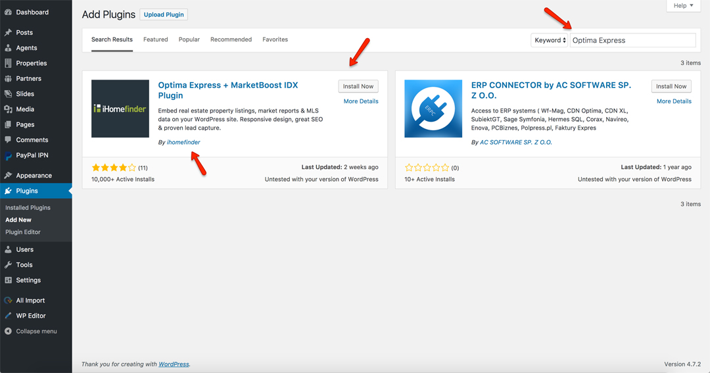
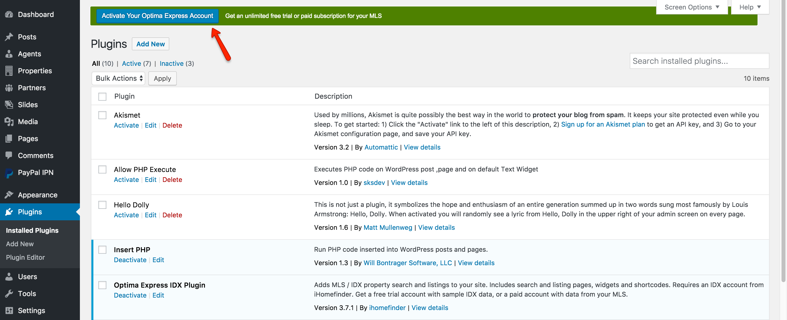
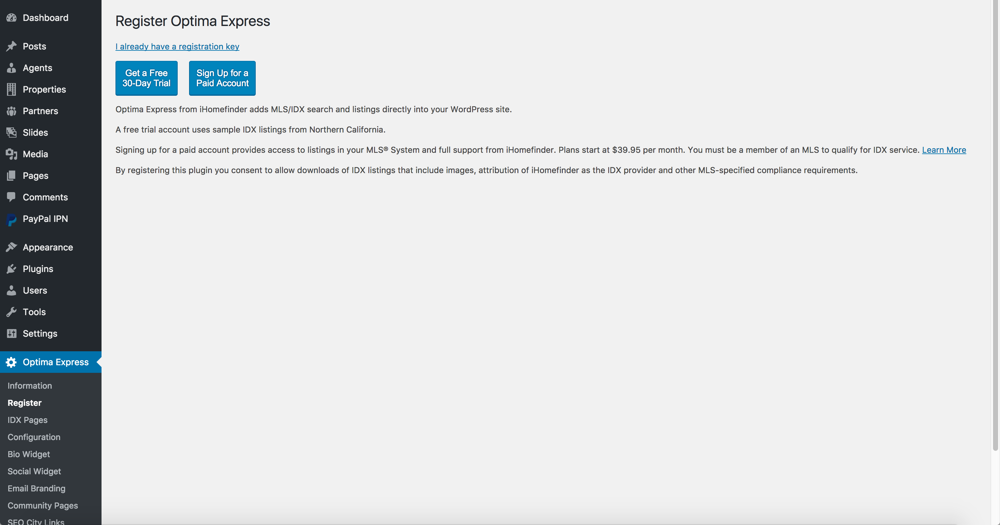

# iHomefinder Optima Express Plugin 

### **Installation**

You can now use [iHomefinder Optima Express Plugin](https://wordpress.org/plugins/optima-express/) on your website.

1. Navigate to WordPress **Dashboard → Plugins → Add New**

2. Type **Optima Express** in the search field, and search

3. Click Install Now under the Optima Express plugin. Kindly make sure to verify before installing that the author of this plugin must be iHomefinder as shown in the screenshot above.

4. After the plugin is installed, click **Activate Plugin**.

### **Register the Optima Express Plugin**

After activating the plugin, select "**Register Optima Express**" at the top of your dashboard.

On the **Register** page, you can:

1. Sign up for a free trial.

2. Sign up for an **IDX account** in your **MLS** (this provides you with a paid account with access to to listings in your MLS. 

3. You can either try this plugin for 30 days by Signing up for a free trial or you can go with a paid option by clicking on Sign Up for a **Paid Account**.
