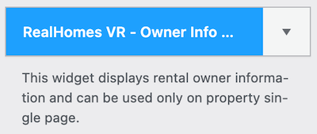
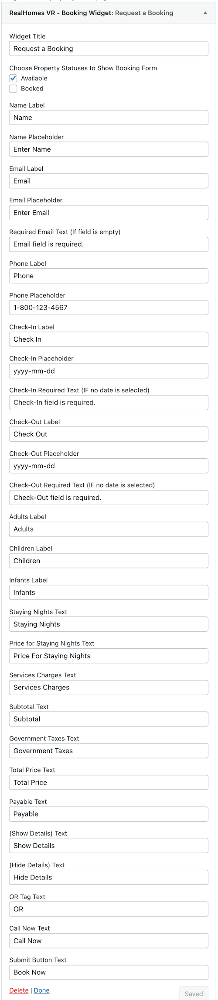

# Owner Info Widget

- Go to **Dashboard → Appearance → Widgets** and look for **RealHomes VR - Owner Info Widget** widget.

- Use this widget in a Property Sidebar as it displays the information of the owner of the current property. 

Now check out the frontend of your site and you will have the **Owner Info** widget displaying on the single property page.

**Modern**

**Ultra**

