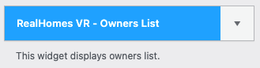
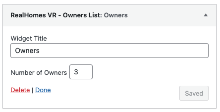

# Owners List Widget

- Go to **Dashboard → Appearance → Widgets** and look for **RealHomes VR - Owners List** widget.

- Use this widget in a sidebar and provide its title. 

Now check out the frontend of your site and you will have the **Agents** widget working for your site.

**Modern**

**Ultra**

