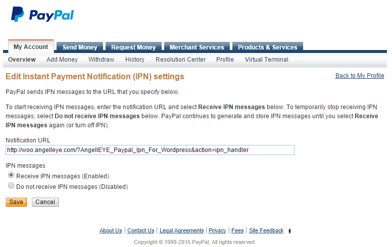

# PayPal IPN Plugin Installation & Setup

### Installation & Activation

You can install and setup [PayPal IPN Plugin](https://wordpress.org/plugins/paypal-ipn/) for payment functionality.

1. Please navigate to **Dashboard → Plugins → Add New** and search for "**PayPal IPN**" as shown in the screenshot below: 

2. Once you have found it then click the "**Install Now**" link under the PayPal IPN for WordPress plugin in the list of results.

3. Click the "**Activate Plugin**" link after the plugin has been installed.

### PayPal IPN Plugin Setup

To setup your **WordPress PayPal IPN listener** you will need to copy your **IPN URL** from the plugin’s general settings tab into your **PayPal account profile’s IPN settings panel**.

1. Kindly navigate to **Dashboard → Settings → PayPal IPN**.

2. **Highlight** the **PayPal IPN Primary URL** and copy it to your clipboard by pressing **Ctrl+C / Cmd+C**.

3. If you wish to enable logging for troubleshooting purposes, check the box and click **Save** as shown in the screenshot.

4. Login to your **PayPal account**.

5. Click the **Profile** link on the **My Account** tab.

6. Click **Instant Payment Notification Preferences** in the **Selling Preferences** section.

7. Click Choose **IPN Settings**.

8. Enter your **IPN URL** that you copied from the plugin settings.

9. Click **Receieve IPN messages (Enabled)** to activate your **IPN listener**.

10. Click **Save** to save your changes.

