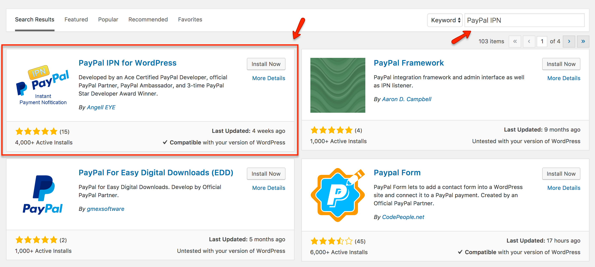
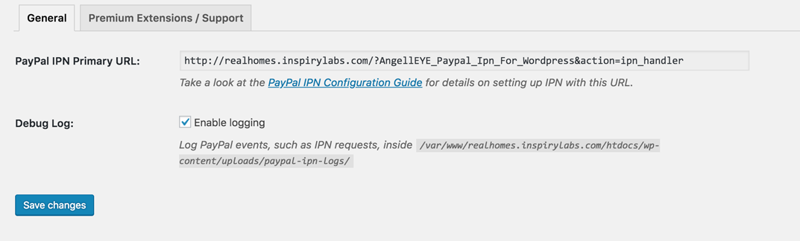
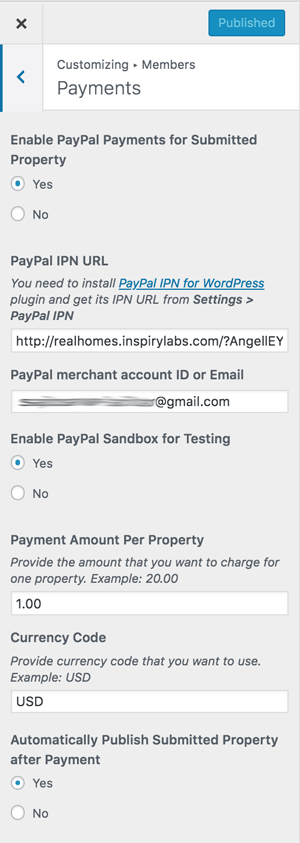

# Individual Property Payments Using PayPal

## Install & Activate PayPal IPN Plugin

You have to install [PayPal IPN Plugin](https://wordpress.org/plugins/paypal-ipn/) for this purpose.

!!!note "Alternative Link to Download"
	If the above link doesn't work then you can **download the plugin directly by [clicking here](https://github.com/InspiryThemes/paypal-ipn/archive/master.zip)**.

1. Navigate to **Dashboard → Plugins → Add New** and search for **PayPal IPN** as shown in the screenshot below: 
	
	

2. Once found, **Install** and **Activate** the plugin.

## Configure related Settings

1. Navigate to **Dashboard → Settings → PayPal IPN** 

	
	
2. Select the **PayPal IPN Primary URL** and copy it to your clipboard by pressing **Ctrl+C** for Windows or **Cmd+C** for Mac.

3. If you want to enable logging for troubleshooting purposes, check the box below and click **Save Changes** as shown in the screenshot above.

4. Navigate to **Dashboard → Real Homes → Customize Settings → Users & Members → Payments** and paste the copied IPN URL in **PayPal IPN URL** field.

	
	
5. Configure other fields based on your requirements and publish settings.

6. Once done, You can visit my properties page on your website to view PayPal payment button for individual properties.

	

!!!note
	In case of any issue, you can signup/login to our [support website](https://support.inspirythemes.com/login-register/) and [ask your question](https://support.inspirythemes.com/ask-question/) over there.