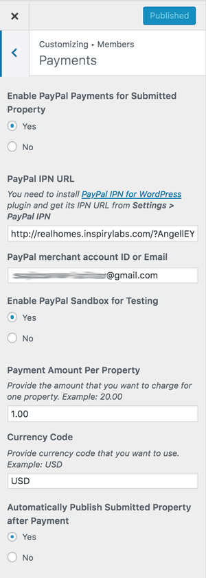

# PayPal Property Payment Settings

In order to set up the paypal payment settings for properties please navigate to **Dashboard → Appearance → Customize → Members → Payments**.

In this section, you have to set the **Payment Ammount Per Property**.

