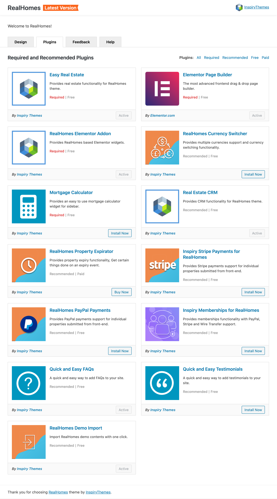

# Required and Recommended Plugins

RealHomes theme has a very own organized plugins management page for its required and recommended plugins. You can access it by navigating to the **Dashboard → Real Homes → Plugins** section.

You can **Activate** or **Deactivate** any plugins with a single click.

