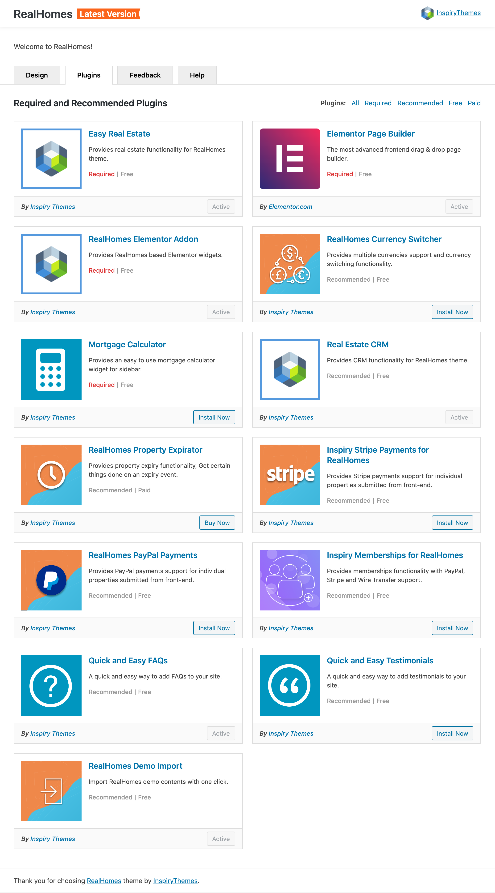

# Required and Recommended Plugins

RealHomes theme has its own organized plugins management page for its required and recommended plugins. You can access it by navigating to **Dashboard → RealHomes → Plugins**.

You can **Activate** or **Deactivate** any plugins with a single click.

### **Integrated Plugins Settings**

Many of the integrated plugins for RealHomes now have their settings centralized in the **Easy Real Estate Options Panel** for easier management.

- **RealHomes Memberships**: `Dashboard → RealHomes → Settings → Memberships`
- **Vacation Rentals**: `Dashboard → RealHomes → Settings → Vacation Rentals`
- **PayPal Payments**: `Dashboard → RealHomes → Settings → PayPal Settings`
- **Stripe Payments**: `Dashboard → RealHomes → Settings → Stripe Settings`
- **Currency Switcher**: `Dashboard → RealHomes → Settings → Currencies Settings`