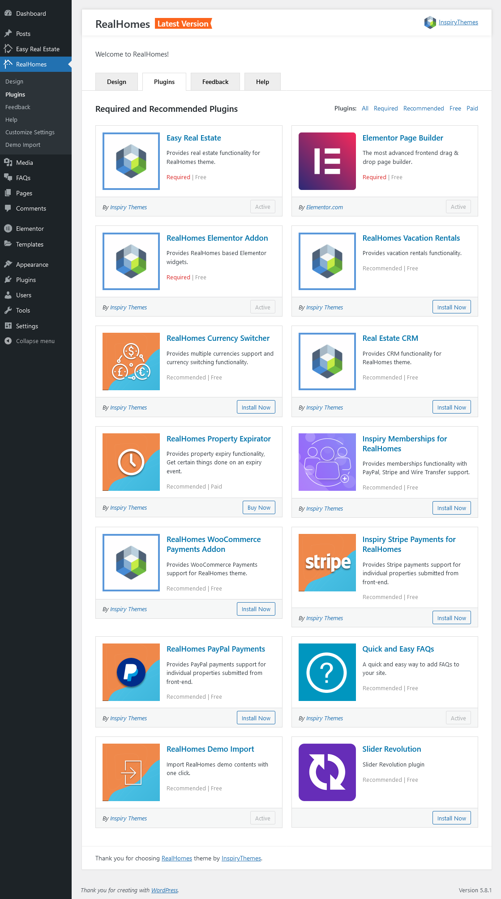

# Required and Recommended Plugins

RealHomes theme offers a very own organized plugins management page for its required and recommended plugins that can be accessed by navigating to **Dashboard → Real Homes → Plugins** page.

Here you can Activate/Deactivate plugins with a single click.

