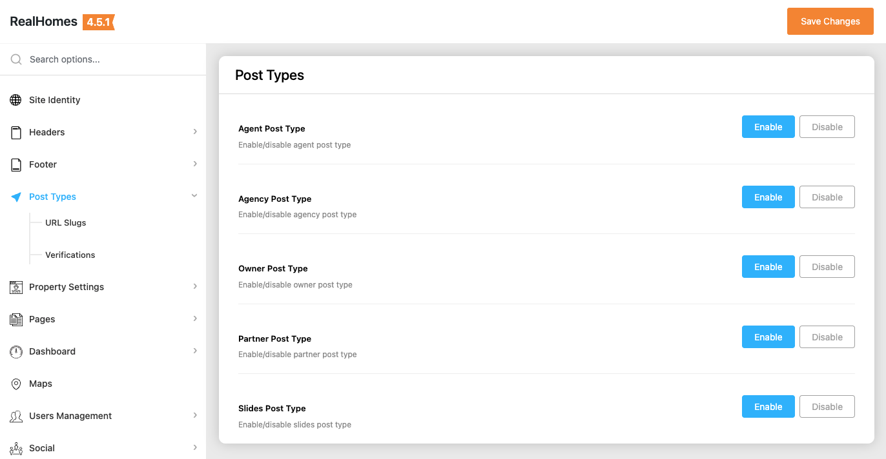
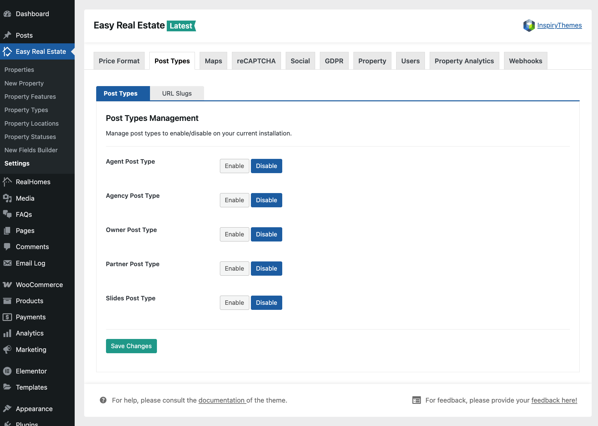

# Post Types Settings

The **Post Types** settings allow you to manage custom post types included in the **Easy Real Estate** plugin, which is a component plugin of **RealHomes**. You can **Enable** or **Disable** specific post types based on the requirements of your real estate website.

To access and configure these settings, follow the navigation path based on your version of the **RealHomes** theme:

---

### **v4.5.1 and Later**

!!! info "Navigation Path"
    **Dashboard** → **RealHomes** → **Settings** → **Post Types** (tab)

---

### **v4.5.0 and Earlier**

!!! info "Navigation Path"
    **Dashboard** → **Easy Real Estate** → **Settings** → **Post Types** (tab)

---

### **Available Post Types**

Under the **Post Types** section, you will see toggle options to manage the following:

- **Agent Post Type**
- **Agency Post Type**
- **Owner Post Type**
- **Partner Post Type**
- **Slides Post Type**

Simply click the appropriate **Enable** or **Disable** button for each post type according to your preferences and click **Save Changes** to apply the updates.

---

### **Crucial Step: Re-save Permalinks**

Whenever you enable or disable a post type, it is **highly recommended** to refresh your site's permalinks to ensure proper URL behavior.

1.  Navigate to **Dashboard → Settings → Permalinks**.
2.  Scroll down and click the **Save Changes** button (no modifications needed on this page).